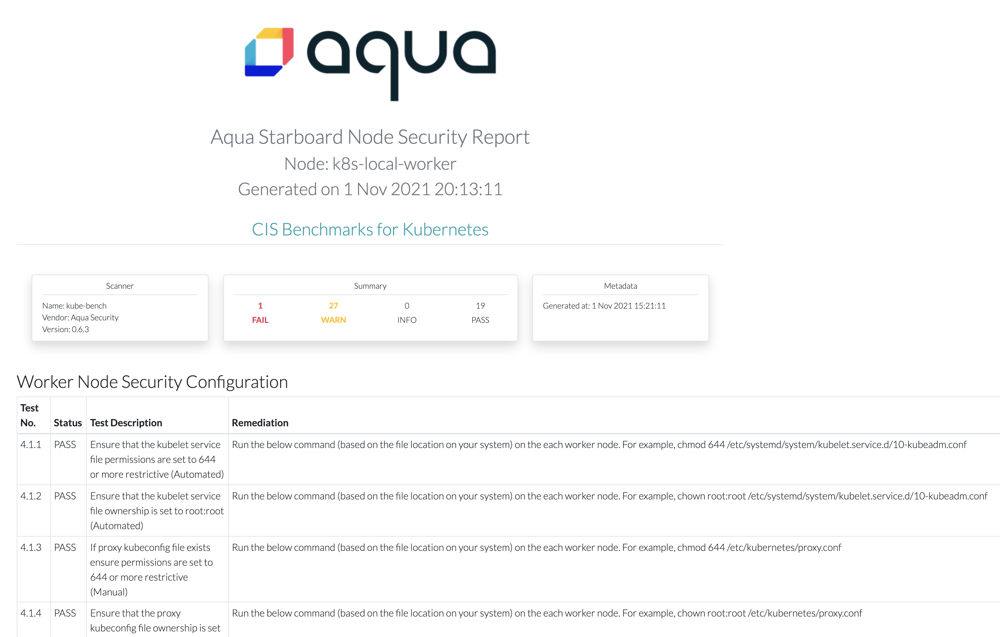
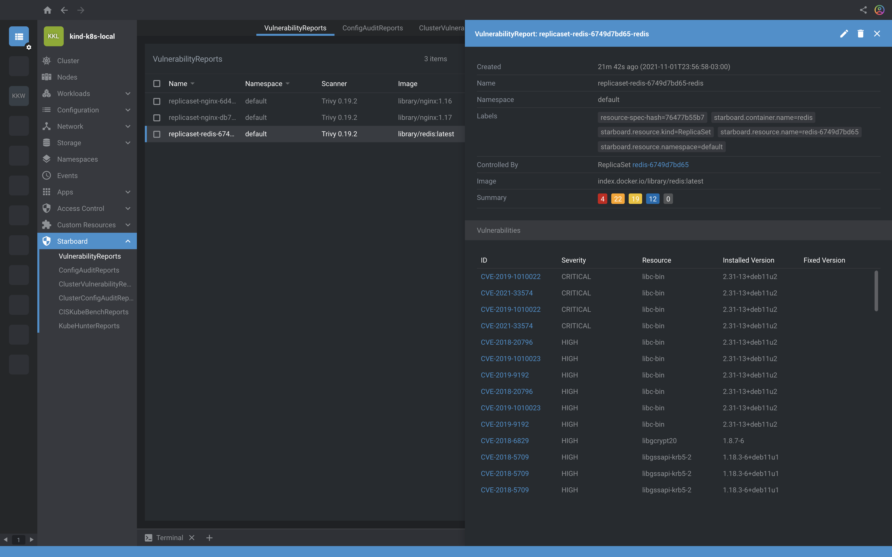

# Security Audit in Kubernetes

## Table of Contents
- [Prerequisites](#prerequisites)
  - [Starboard Installation](#starboard-installation)
- [Workloads Scanning](#workloads-scanning)
  - Updating the workload
- [Kubernetes benchmarks for best practice security](#kubernetes-benchmarks-for-best-practice-security)
  - [Kube-bench](#kube-bench)
  - [Kube-hunter](#kube-hunter)
- [Scanning Workloads for Misconfigurations](#scanning-workloads-for-misconfigurations)
  - [Polaris](#polaris)
  - [Conftest](#conftest)
- [Integration](#integration)
  - Lens
  - Octant

## Prerequisites

- A kubernetes cluster: minikube, kind, or any kubernetes flavor.
- Starboard CLI or starboard operator

Create a cluster kubernetes using Kind

> See the [kind.yaml](kind.yaml)

```
kind create cluster --name k8s-local --config kind.yaml --image kindest/node:v1.20.7
```

<details>
<summary>Show results</summary>

```
 kind create cluster --name k8s-local --config kind.yaml --image kindest/node:v1.20.7
Creating cluster "k8s-local" ...
 ✓ Ensuring node image (kindest/node:v1.20.7) 🖼
 ✓ Preparing nodes 📦 📦 📦
 ✓ Writing configuration 📜
 ✓ Starting control-plane 🕹️
 ✓ Installing CNI 🔌
 ✓ Installing StorageClass 💾
 ✓ Joining worker nodes 🚜
Set kubectl context to "kind-k8s-local"
You can now use your cluster with:

kubectl cluster-info --context kind-k8s-local

Not sure what to do next? 😅  Check out https://kind.sigs.k8s.io/docs/user/quick-start/
```
</details></br>

Validate the pods `kubectl get pods -A`

<details>
<summary>Show results</summary>

```
k get pods -A
NAMESPACE            NAME                                              READY   STATUS    RESTARTS   AGE
kube-system          coredns-74ff55c5b-gtrql                           1/1     Running   0          5m22s
kube-system          coredns-74ff55c5b-jpt4c                           1/1     Running   0          5m22s
kube-system          etcd-k8s-local-control-plane                      1/1     Running   0          5m23s
kube-system          kindnet-6ns7f                                     1/1     Running   0          5m11s
kube-system          kindnet-98fx6                                     1/1     Running   0          5m11s
kube-system          kindnet-lx47p                                     1/1     Running   0          5m22s
kube-system          kube-apiserver-k8s-local-control-plane            1/1     Running   0          5m23s
kube-system          kube-controller-manager-k8s-local-control-plane   1/1     Running   0          5m23s
kube-system          kube-proxy-5xjkb                                  1/1     Running   0          5m11s
kube-system          kube-proxy-ptfm5                                  1/1     Running   0          5m11s
kube-system          kube-proxy-tzz5m                                  1/1     Running   0          5m22s
kube-system          kube-scheduler-k8s-local-control-plane            1/1     Running   0          5m23s
local-path-storage   local-path-provisioner-547f784dff-vc47c           1/1     Running   0          5m22s
```
</details></br>

Checking the nodes `kubectl get nodes -o wide`

<details>
<summary>Show results</summary>

```
 k get nodes -o wide
NAME                      STATUS   ROLES                  AGE     VERSION   INTERNAL-IP   EXTERNAL-IP   OS-IMAGE       KERNEL-VERSION     CONTAINER-RUNTIME
k8s-local-control-plane   Ready    control-plane,master   6m34s   v1.20.7   172.18.0.3    <none>        Ubuntu 21.04   5.10.25-linuxkit   containerd://1.5.2
k8s-local-worker          Ready    <none>                 6m6s    v1.20.7   172.18.0.2    <none>        Ubuntu 21.04   5.10.25-linuxkit   containerd://1.5.2
k8s-local-worker2         Ready    <none>                 6m6s    v1.20.7   172.18.0.4    <none>        Ubuntu 21.04   5.10.25-linuxkit   containerd://1.5.2
```
</details></br>

## Starboard Installation

### [Install Starboard CLI using krew](https://aquasecurity.github.io/starboard/v0.12.0/cli/installation/krew/)

```
kubectl krew install starboard
```

<details>
<summary>Show results</summary>

```
kubectl krew install starboard

Updated the local copy of plugin index.
Installing plugin: starboard
Installed plugin: starboard
\
 | Use this plugin:
 | 	kubectl starboard
 | Documentation:
 | 	https://github.com/aquasecurity/starboard
 | Caveats:
 | \
 |  | The plugin requires access to create Jobs and CustomResources.
 | /
/
WARNING: You installed plugin "starboard" from the krew-index plugin repository.
   These plugins are not audited for security by the Krew maintainers.
   Run them at your own risk.
```
</details></br>

Checking the starboard version

```
kubectl starboard version
Starboard Version: {Version:0.12.0 Commit:7b7db3acb673a7aaed50839aed168cba8163230a Date:2021-09-15T17:30:09Z}
```

### [Install Starboard Operator using kubectl](https://aquasecurity.github.io/starboard/v0.12.0/operator/installation/kubectl/)

Send custom resource definitions to the Kubernetes API:
```
kubectl apply -f https://raw.githubusercontent.com/aquasecurity/starboard/v0.12.0/deploy/crd/vulnerabilityreports.crd.yaml \
  -f https://raw.githubusercontent.com/aquasecurity/starboard/v0.12.0/deploy/crd/configauditreports.crd.yaml \
  -f https://raw.githubusercontent.com/aquasecurity/starboard/v0.12.0/deploy/crd/clusterconfigauditreports.crd.yaml \
  -f https://raw.githubusercontent.com/aquasecurity/starboard/v0.12.0/deploy/crd/ciskubebenchreports.crd.yaml
```

<details>
<summary>Show results</summary>

```
kubectl apply -f https://raw.githubusercontent.com/aquasecurity/starboard/v0.12.0/deploy/crd/vulnerabilityreports.crd.yaml \
  -f https://raw.githubusercontent.com/aquasecurity/starboard/v0.12.0/deploy/crd/configauditreports.crd.yaml \
  -f https://raw.githubusercontent.com/aquasecurity/starboard/v0.12.0/deploy/crd/clusterconfigauditreports.crd.yaml \
  -f https://raw.githubusercontent.com/aquasecurity/starboard/v0.12.0/deploy/crd/ciskubebenchreports.crd.yaml

customresourcedefinition.apiextensions.k8s.io/vulnerabilityreports.aquasecurity.github.io created
customresourcedefinition.apiextensions.k8s.io/configauditreports.aquasecurity.github.io created
customresourcedefinition.apiextensions.k8s.io/clusterconfigauditreports.aquasecurity.github.io created
customresourcedefinition.apiextensions.k8s.io/ciskubebenchreports.aquasecurity.github.io created
```
</details></br>

Send the following Kubernetes objects definitions to the Kubernetes API:
```
kubectl apply -f https://raw.githubusercontent.com/aquasecurity/starboard/v0.12.0/deploy/static/01-starboard-operator.ns.yaml \
  -f https://raw.githubusercontent.com/aquasecurity/starboard/v0.12.0/deploy/static/02-starboard-operator.sa.yaml \
  -f https://raw.githubusercontent.com/aquasecurity/starboard/v0.12.0/deploy/static/03-starboard-operator.clusterrole.yaml \
  -f https://raw.githubusercontent.com/aquasecurity/starboard/v0.12.0/deploy/static/04-starboard-operator.clusterrolebinding.yaml
```

<details>
<summary>Show results</summary>

```
kubectl apply -f https://raw.githubusercontent.com/aquasecurity/starboard/v0.12.0/deploy/static/01-starboard-operator.ns.yaml \
  -f https://raw.githubusercontent.com/aquasecurity/starboard/v0.12.0/deploy/static/02-starboard-operator.sa.yaml \
  -f https://raw.githubusercontent.com/aquasecurity/starboard/v0.12.0/deploy/static/03-starboard-operator.clusterrole.yaml \
  -f https://raw.githubusercontent.com/aquasecurity/starboard/v0.12.0/deploy/static/04-starboard-operator.clusterrolebinding.yaml

namespace/starboard-operator created
serviceaccount/starboard-operator created
clusterrole.rbac.authorization.k8s.io/starboard-operator created
clusterrolebinding.rbac.authorization.k8s.io/starboard-operator created
```
</details></br>

Validate the resources

```
kubectl get crd
```

<details>
<summary>Show results</summary>

```
k get crd
NAME                                               CREATED AT
ciskubebenchreports.aquasecurity.github.io         2021-11-01T18:11:39Z
clusterconfigauditreports.aquasecurity.github.io   2021-11-01T18:11:39Z
configauditreports.aquasecurity.github.io          2021-11-01T18:11:39Z
vulnerabilityreports.aquasecurity.github.io        2021-11-01T18:11:39Z
```
</details></br>

create the starboard-operator Deployment in the starboard-operator

```
kubectl apply -f https://raw.githubusercontent.com/aquasecurity/starboard/v0.12.0/deploy/static/06-starboard-operator.deployment.yaml
```

<details>
<summary>Show results</summary>

```
 kubectl apply -f https://raw.githubusercontent.com/aquasecurity/starboard/v0.12.0/deploy/static/06-starboard-operator.deployment.yaml

deployment.apps/starboard-operator created
```
</details></br>

```
kubectl get all -n starboard-operator
```

<details>
<summary>Show results</summary>

```
kubectl get all -n starboard-operator
NAME                                      READY   STATUS    RESTARTS   AGE
pod/starboard-operator-665549dfdf-xpkj4   1/1     Running   0          22m

NAME                                 READY   UP-TO-DATE   AVAILABLE   AGE
deployment.apps/starboard-operator   1/1     1            1           22m

NAME                                            DESIRED   CURRENT   READY   AGE
replicaset.apps/starboard-operator-665549dfdf   1         1         1       22m
```
</details></br>

### Initialize Starboard

```
kubectl starboard init -v 3
```

<details>
<summary>Show results</summary>

```
kubectl starboard init -v 3
I1101 15:44:32.535644   60027 installer.go:371] Updating CRD "vulnerabilityreports.aquasecurity.github.io"
I1101 15:44:32.553407   60027 installer.go:371] Updating CRD "ciskubebenchreports.aquasecurity.github.io"
I1101 15:44:32.565327   60027 installer.go:377] Creating CRD "kubehunterreports.aquasecurity.github.io"
I1101 15:44:32.581302   60027 installer.go:371] Updating CRD "configauditreports.aquasecurity.github.io"
I1101 15:44:32.596900   60027 installer.go:371] Updating CRD "clusterconfigauditreports.aquasecurity.github.io"
I1101 15:44:32.608481   60027 installer.go:309] Creating Namespace "starboard"
I1101 15:44:32.680899   60027 installer.go:324] Creating ServiceAccount "starboard/starboard"
I1101 15:44:32.694457   60027 installer.go:341] Creating ClusterRole "starboard"
I1101 15:44:32.708129   60027 installer.go:359] Creating ClusterRoleBinding "starboard"
```
</details></br>

## Workloads scanning

Using Starboard Operator, after create a deployment, you will get the audit reports about this.

```
kubectl create deployment nginx --image nginx:1.16
```

<details>
<summary>Show results</summary>

```
kubectl create deployment nginx --image nginx:1.16
deployment.apps/nginx created
```
</details></br>

```
kubectl get job -n starboard-operator
```

<details>
<summary>Show results</summary>

```
 kubectl get job -n starboard-operator
NAME                                  COMPLETIONS   DURATION   AGE
scan-configauditreport-866469b84d     0/1           18s        18s
scan-vulnerabilityreport-866469b84d   0/1           18s        18s
```
</details></br>

```
kubectl get vulnerabilityreports -o wide
```

<details>
<summary>Show results</summary>

```
kubectl get vulnerabilityreports -o wide
NAME                                REPOSITORY      TAG    SCANNER   AGE   CRITICAL   HIGH   MEDIUM   LOW   UNKNOWN
replicaset-nginx-6d4cf56db6-nginx   library/nginx   1.16   Trivy     12m   25         85     84       15    0
```
</details></br>

```
kubectl get configauditreports -o wide
```

<details>
<summary>Show results</summary>

```
kubectl get configauditreports -o wide
NAME                          SCANNER   AGE   DANGER   WARNING   PASS
replicaset-nginx-6d4cf56db6   Polaris   13m   1        9         7
```
</details></br>

```
kubectl tree deploy nginx
```

<details>
<summary>Show results</summary>

```
 kubectl tree deploy nginx
NAMESPACE  NAME                                                       READY  REASON  AGE
default    Deployment/nginx                                           -              14m
default    └─ReplicaSet/nginx-6d4cf56db6                              -              14m
default      ├─ConfigAuditReport/replicaset-nginx-6d4cf56db6          -              13m
default      ├─Pod/nginx-6d4cf56db6-hvvz5                             True           14m
default      └─VulnerabilityReport/replicaset-nginx-6d4cf56db6-nginx  -              13m
```
</details></br>

### Updating the workload

```
kubectl set image deployment nginx nginx=nginx:1.17
```

<details>
<summary>Show results</summary>

```
kubectl set image deployment nginx nginx=nginx:1.17
deployment.apps/nginx image updated
```
</details></br>

```
kubectl get job -n starboard-operator
```

<details>
<summary>Show results</summary>

```
kubectl get job -n starboard-operator

NAME                                 COMPLETIONS   DURATION   AGE
scan-configauditreport-9f45bbddd     0/1           7s         7s
scan-vulnerabilityreport-9f45bbddd   0/1           7s         7s
```
</details></br>

```
kubectl tree deploy nginx
```

<details>
<summary>Show results</summary>

```
 kubectl tree deploy nginx
NAMESPACE  NAME                                                       READY  REASON  AGE
default    Deployment/nginx                                           -              33m
default    ├─ReplicaSet/nginx-6d4cf56db6                              -              33m
default    │ ├─ConfigAuditReport/replicaset-nginx-6d4cf56db6          -              32m
default    │ └─VulnerabilityReport/replicaset-nginx-6d4cf56db6-nginx  -              32m
default    └─ReplicaSet/nginx-db749865c                               -              2m6s
default      ├─ConfigAuditReport/replicaset-nginx-db749865c           -              117s
default      ├─Pod/nginx-db749865c-fxtb5                              True           2m6s
default      └─VulnerabilityReport/replicaset-nginx-db749865c-nginx   -              113s
```
</details></br>

```
kubectl get vulnerabilityreport -o wide
```

<details>
<summary>Show results</summary>

```
kubectl get vulnerabilityreport -o wide
NAME                                REPOSITORY      TAG    SCANNER   AGE     CRITICAL   HIGH   MEDIUM   LOW   UNKNOWN
replicaset-nginx-6d4cf56db6-nginx   library/nginx   1.16   Trivy     33m     25         85     84       15    0
replicaset-nginx-db749865c-nginx    library/nginx   1.17   Trivy     2m40s   25         83     82       15    0
```
</details></br>

> This steps is based on the Starboard Documentation [here](https://aquasecurity.github.io/starboard/v0.12.0/operator/getting-started/)

## Kubernetes Benchmarks for Best Practice Security
### Kube-bench

[kube-bench](https://github.com/aquasecurity/kube-bench) is a tool that checks whether Kubernetes is deployed securely by running the checks documented in the CIS Kubernetes Benchmark.

> Using starboard operator, automatically was created the CIS Kube-bench report.

Validating that the report was created.

```
kubectl get nodes
```

<details>
<summary>Show results</summary>

```
kubectl get nodes
NAME                      STATUS   ROLES                  AGE     VERSION
k8s-local-control-plane   Ready    control-plane,master   4h36m   v1.20.7
k8s-local-worker          Ready    <none>                 4h35m   v1.20.7
k8s-local-worker2         Ready    <none>                 4h35m   v1.20.7
```
</details></br>

Check the CIS kube-bench reports

```
kubectl get ciskubebenchreports -o wide
```

<details>
<summary>Show results</summary>

```
kubectl get ciskubebenchreports -o wide
NAME                      SCANNER      AGE     FAIL   WARN   INFO   PASS
k8s-local-control-plane   kube-bench   4h47m   11     41     0      70
k8s-local-worker          kube-bench   4h47m   1      27     0      19
k8s-local-worker2         kube-bench   4h47m   1      27     0      19
```
</details></br>

```
kubectl tree node k8s-local-control-plane -A
```

<details>
<summary>Show results</summary>

```
kubectl tree node k8s-local-control-plane -A
NAMESPACE        NAME                                                   READY  REASON        AGE
                 Node/k8s-local-control-plane                           True   KubeletReady  4h36m
                 ├─CISKubeBenchReport/k8s-local-control-plane           -                    4h8m
                 ├─CSINode/k8s-local-control-plane                      -                    4h36m
kube-node-lease  ├─Lease/k8s-local-control-plane                        -                    4h36m
kube-system      ├─Pod/etcd-k8s-local-control-plane                     True                 4h36m
kube-system      ├─Pod/kube-apiserver-k8s-local-control-plane           True                 4h36m
kube-system      ├─Pod/kube-controller-manager-k8s-local-control-plane  True                 4h36m
kube-system      └─Pod/kube-scheduler-k8s-local-control-plane           True                 4h36m
```
</details></br>

#### Generate the Audit Report HTML


Generate the report HTML using starboard CLI

```
kubectl starboard get report nodes/k8s-local-worker > node01-report.html
```



### Kube-hunter

[kube-hunter](https://github.com/aquasecurity/kube-hunter) hunts for security weaknesses in Kubernetes clusters. The tool was developed to increase awareness and visibility for security issues in Kubernetes environments.

Using the starboard CLI

```
kubectl starboard scan kubehunterreports -v 3
```

<details>
<summary>Show results</summary>

```
kubectl starboard scan kubehunterreports -v 3
I1101 20:37:49.893737   84246 runner.go:79] Running task and waiting forever
I1101 20:37:49.894952   84246 runnable_job.go:74] Creating job "starboard/scan-kubehunterreports-7594df9b45"
I1101 20:37:49.930856   84246 reflector.go:219] Starting reflector *v1.Event (30m0s) from pkg/mod/k8s.io/client-go@v0.22.1/tools/cache/reflector.go:167
I1101 20:37:49.930883   84246 reflector.go:255] Listing and watching *v1.Event from pkg/mod/k8s.io/client-go@v0.22.1/tools/cache/reflector.go:167
I1101 20:37:49.930884   84246 reflector.go:219] Starting reflector *v1.Job (30m0s) from pkg/mod/k8s.io/client-go@v0.22.1/tools/cache/reflector.go:167
I1101 20:37:49.930923   84246 reflector.go:255] Listing and watching *v1.Job from pkg/mod/k8s.io/client-go@v0.22.1/tools/cache/reflector.go:167
I1101 20:37:49.970120   84246 runnable_job.go:130] Event: Created pod: scan-kubehunterreports-7594df9b45-vspcf (SuccessfulCreate)
I1101 20:38:16.993574   84246 runnable_job.go:130] Event: Job completed (Completed)
I1101 20:38:17.006340   84246 runnable_job.go:109] Stopping runnable job on task completion with status: Complete
I1101 20:38:17.006513   84246 runner.go:83] Stopping runner on task completion with error: <nil>
I1101 20:38:17.007331   84246 scanner.go:81] Getting logs for kube-hunter container in job: starboard/scan-kubehunterreports-7594df9b45
I1101 20:38:17.073891   84246 scanner.go:73] Deleting job: starboard/scan-kubehunterreports-7594df9b45
```
</details></br>

```
kubectl get kubehunterreports -o wide
```

<details>
<summary>Show results</summary>

```
kubectl get kubehunterreports -o wide
NAME      SCANNER       AGE   HIGH   MEDIUM   LOW
cluster   kube-hunter   97s   0      0        1
```
</details></br>

In case of any problem, take a look in the jobs generated.

```
k -n starboard get jobs
```

<details>
<summary>Show results</summary>

```
k -n starboard get jobs
NAME                                COMPLETIONS   DURATION   AGE
scan-kubehunterreports-7594df9b45   0/1           13s        13s
```
</details></br>

## Scanning Workloads for Misconfigurations

### Polaris

Starboard used Polaris by default as a configuration checker. More details [here](https://aquasecurity.github.io/starboard/v0.12.0/integrations/config-checkers/polaris/)

After it was installed Starboard Operator, it was generated the config audit reports using [Polaris](https://github.com/FairwindsOps/polaris)

```
kubectl get configauditreports.aquasecurity.github.io -o wide
```

<details>
<summary>Show results</summary>

```
kubectl get configauditreports.aquasecurity.github.io -o wide
NAME                          SCANNER   AGE     DANGER   WARNING   PASS
replicaset-nginx-6d4cf56db6   Polaris   5h10m   1        9         7
replicaset-nginx-db749865c    Polaris   4h39m   1        9         7
```
</details></br>

> More details about Starboard and Polaris [here](https://aquasecurity.github.io/starboard/v0.12.0/integrations/config-checkers/polaris/)

```
kubectl get configauditreports replicaset-nginx-db749865c -o yaml
```

<details>
<summary>Show results</summary>

```
k get configauditreports replicaset-nginx-db749865c -o yaml
apiVersion: aquasecurity.github.io/v1alpha1
kind: ConfigAuditReport
metadata:
  creationTimestamp: "2021-11-01T19:21:32Z"
  generation: 1
  labels:
    plugin-config-hash: 7dfd59f689
    resource-spec-hash: 854ff96cb4
    starboard.resource.kind: ReplicaSet
    starboard.resource.name: nginx-db749865c
    starboard.resource.namespace: default
  name: replicaset-nginx-db749865c
  namespace: default
  ownerReferences:
  - apiVersion: apps/v1
    blockOwnerDeletion: false
    controller: true
    kind: ReplicaSet
    name: nginx-db749865c
    uid: 1e12873c-f5f4-4e2d-b55c-00d5e81f9874
  resourceVersion: "10985"
  uid: 971664af-d4d4-4859-b8f6-53659269c381
report:
  checks:
  - category: Security
    checkID: hostIPCSet
    message: Host IPC is not configured
    severity: danger
    success: true
  - category: Security
    checkID: hostNetworkSet
    message: Host network is not configured
    severity: warning
    success: true
  - category: Security
    checkID: hostPIDSet
    message: Host PID is not configured
    severity: danger
    success: true
  - category: Efficiency
    checkID: cpuLimitsMissing
    message: CPU limits should be set
    scope:
      type: Container
      value: nginx
    severity: warning
    success: false
  - category: Efficiency
    checkID: memoryRequestsMissing
    message: Memory requests should be set
    scope:
      type: Container
      value: nginx
    severity: warning
    success: false
  - category: Efficiency
    checkID: cpuRequestsMissing
    message: CPU requests should be set
    scope:
      type: Container
      value: nginx
    severity: warning
    success: false
  - category: Security
    checkID: dangerousCapabilities
    message: Container does not have any dangerous capabilities
    scope:
      type: Container
      value: nginx
    severity: danger
    success: true
...
```
</details></br>

### Conftest

[Conftest](https://github.com/open-policy-agent/conftest) uses the Rego language from Open Policy Agent for writing tests against structured configuration data.

By default Starboard used Polaris, we could check the default configuration checker:

```
kubectl -n starboard get cm starboard -o yaml | grep configAuditReports
```

<details>
<summary>Show results</summary>

```
kubectl -n starboard get cm starboard -o yaml | grep configAuditReports -A 5
  configAuditReports.scanner: Polaris
  kube-bench.imageRef: docker.io/aquasec/kube-bench:0.6.3
  kube-hunter.imageRef: docker.io/aquasec/kube-hunter:0.6.1
  kube-hunter.quick: "false"
  vulnerabilityReports.scanner: Trivy
kind: ConfigMap
```
</details></br>

To use Conftest, we need to edit the configmap 'starboard' in the namespace used by the starboard CLI:

```
kubectl patch cm starboard -n starboard \
 --type merge \
 -p "$(cat <<EOF
{
 "data": {
   "configAuditReports.scanner": "Conftest"
 }
}
EOF
)"
```

**AppShield**

[AppShield](https://github.com/aquasecurity/appshield) is a collection of policies for detecting mis-configurations, specifically security issues, in configuration files and Infrastructure as Code definitions.

```
git clone https://github.com/aquasecurity/appshield
cd appshield
```

Following the starboard about Conftest documentation, we create the **configmap** `starboard-conftest-config` with the OPA libraries called kubernetes.rego and utils.rego.

> More details [here in the starboard documentation](https://aquasecurity.github.io/starboard/v0.12.0/integrations/config-checkers/conftest/)

```
kubectl create configmap starboard-conftest-config -n starboard \
  --from-literal=conftest.imageRef=openpolicyagent/conftest:v0.25.0 \
  --from-file=conftest.policy.kubernetes.rego=kubernetes/lib/kubernetes.rego \
  --from-file=conftest.policy.utils.rego=kubernetes/lib/utils.rego \
  --from-file=conftest.policy.file_system_not_read_only.rego=kubernetes/policies/general/file_system_not_read_only.rego \
  --from-file=conftest.policy.uses_image_tag_latest.rego=kubernetes/policies/general/uses_image_tag_latest.rego
```

Validate the configmap created `kubectl -n starboard get cm`

<details>
<summary>Show results</summary>

```
k -n starboard get cm
NAME                        DATA   AGE
kube-root-ca.crt            1      8h
starboard                   5      8h
starboard-conftest-config   5      19s
starboard-polaris-config    6      8h
starboard-trivy-config      7      8h
```
</details></br>

Create a sample deployment to validate the conftest audit report:
```
kubectl create deployment redis --image redis
```

Using the starboard CLI, we will scan the redis deployment resource:

```
kubectl starboard scan configauditreports deployment/redis -v 3
```

<details>
<summary>Show results</summary>

```
kubectl starboard scan configauditreports deployment/redis -v 3
I1102 00:01:28.406124    3236 scanner.go:67] Scanning with options: {ScanJobTimeout:0s DeleteScanJob:true}
I1102 00:01:28.431293    3236 runner.go:79] Running task and waiting forever
I1102 00:01:28.431383    3236 runnable_job.go:67] Creating secret "starboard/scan-configauditreport-5d47d7484c-volume"
I1102 00:01:28.450068    3236 runnable_job.go:74] Creating job "starboard/scan-configauditreport-5d47d7484c"
I1102 00:01:28.468978    3236 runnable_job.go:81] Setting owner reference secret "starboard/scan-configauditreport-5d47d7484c-volume" -> job "starboard/scan-configauditreport-5d47d7484c"
I1102 00:01:28.469004    3236 runnable_job.go:86] Updating secret "starboard/scan-configauditreport-5d47d7484c-volume"
I1102 00:01:28.494000    3236 reflector.go:219] Starting reflector *v1.Event (30m0s) from pkg/mod/k8s.io/client-go@v0.22.1/tools/cache/reflector.go:167
I1102 00:01:28.494007    3236 reflector.go:219] Starting reflector *v1.Job (30m0s) from pkg/mod/k8s.io/client-go@v0.22.1/tools/cache/reflector.go:167
I1102 00:01:28.494028    3236 reflector.go:255] Listing and watching *v1.Event from pkg/mod/k8s.io/client-go@v0.22.1/tools/cache/reflector.go:167
I1102 00:01:28.494032    3236 reflector.go:255] Listing and watching *v1.Job from pkg/mod/k8s.io/client-go@v0.22.1/tools/cache/reflector.go:167
I1102 00:01:28.550332    3236 runnable_job.go:130] Event: Created pod: scan-configauditreport-5d47d7484c-l7j2t (SuccessfulCreate)
I1102 00:01:37.957274    3236 runnable_job.go:130] Event: Job completed (Completed)
I1102 00:01:37.969905    3236 runnable_job.go:109] Stopping runnable job on task completion with status: Complete
I1102 00:01:37.969933    3236 runner.go:83] Stopping runner on task completion with error: <nil>
I1102 00:01:37.969942    3236 scanner.go:99] Getting logs for conftest container in job: starboard/scan-configauditreport-5d47d7484c
I1102 00:01:38.045587    3236 scanner.go:90] Deleting scan job: starboard/scan-configauditreport-5d47d7484c
```
</details></br>

Check the config audit report using Conftest:

```
k get configauditreports -o wide
```

<details>
<summary>Show results</summary>

```
k get configauditreports -o wide
NAME                          SCANNER    AGE     DANGER   WARNING   PASS
deployment-redis              Conftest   118s    2        0         0
replicaset-nginx-6d4cf56db6   Polaris    8h      1        9         7
replicaset-nginx-db749865c    Polaris    7h42m   1        9         7
replicaset-redis-6749d7bd65   Polaris    6m52s   2        9         6
```
</details></br>

```
kubectl get configauditreport deployment-redis -o yaml
```

<details>
<summary>Show results</summary>

```
kubectl get configauditreport deployment-redis -o yaml
apiVersion: aquasecurity.github.io/v1alpha1
kind: ConfigAuditReport
metadata:
  creationTimestamp: "2021-11-02T03:01:38Z"
  generation: 1
  labels:
    plugin-config-hash: 9657c9b65
    resource-spec-hash: 76477b55b7
    starboard.resource.kind: Deployment
    starboard.resource.name: redis
    starboard.resource.namespace: default
  name: deployment-redis
  namespace: default
  ownerReferences:
  - apiVersion: apps/v1
    blockOwnerDeletion: false
    controller: true
    kind: Deployment
    name: redis
    uid: fc5f4178-0489-40fb-82fd-848dd04c2b19
  resourceVersion: "45389"
  uid: 2a2aba85-a07f-480b-9aeb-e0ccbe2bbdee
report:
  checks:
  - category: Security
    checkID: Image tag ':latest' used
    message: Container 'redis' of Deployment 'redis' should specify an image tag
    severity: danger
    success: false
  - category: Security
    checkID: Root file system is not read-only
    message: Container 'redis' of Deployment 'redis' should set 'securityContext.readOnlyRootFilesystem'
      to true
    severity: danger
    success: false
  containerChecks: {}
  podChecks:
  - category: Security
    checkID: Image tag ':latest' used
    message: Container 'redis' of Deployment 'redis' should specify an image tag
    severity: danger
    success: false
  - category: Security
    checkID: Root file system is not read-only
    message: Container 'redis' of Deployment 'redis' should set 'securityContext.readOnlyRootFilesystem'
      to true
    severity: danger
    success: false
  scanner:
    name: Conftest
    vendor: Open Policy Agent
    version: v0.25.0
  summary:
    dangerCount: 2
    passCount: 0
    warningCount: 0
  updateTimestamp: "2021-11-02T03:01:38Z"
```
</details></br>

## Integration

### [Lens](https://k8slens.dev/)

Installing the Starboard Lens Extension provides visibility into vulnerability assessment reports for Kubernetes workloads stored as custom resources.

> Latest release to install in Lens: https://github.com/aquasecurity/starboard-lens-extension/releases/download/v0.3.0/starboard-lens-extension-0.3.0.tgz




