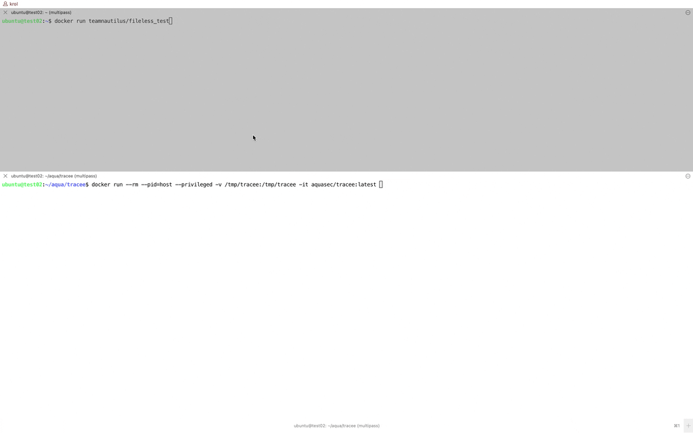
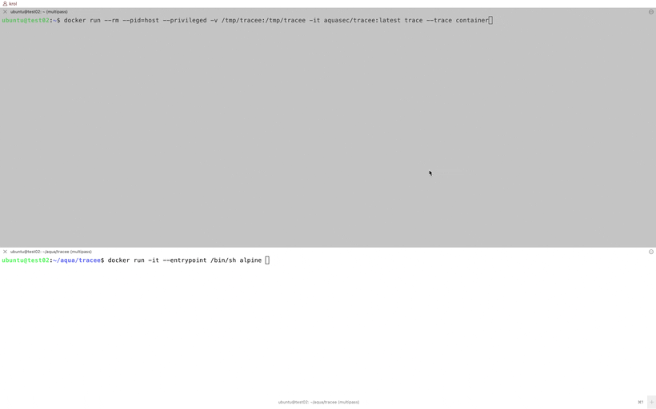
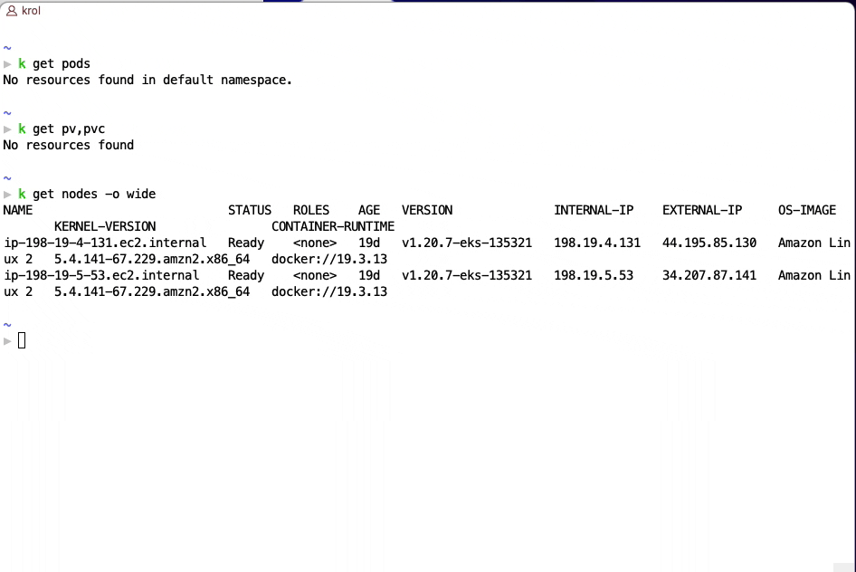

# Runtime Security

## Table of Contents
- [Prerequisites](#prerequisites)
- [Tracee](#tracee)
  - [Tracee Signatures](#tracee-signatures)
  - [Trace](#trace)
  - [Trace Containers](#trace-containers)
  - [Trace Events](#misconfigurations-in-kubernetes)
- Tracee in Kubernetes

## Prerequisites

Before you begin, you need the following software:

- A Linux, stand-alone virtual machine (VM)
- Docker container runtime

## Tracee

Tracee is a Runtime Security and forensics tool for Linux using eBPF. 

It is using Linux eBPF technology to trace your system and applications at runtime, and analyze collected events to detect suspicious behavioral patterns.

Explore tracee using `docker run aquasec/tracee:latest -h`

<details>
<summary>Show results</summary>

```
docker run aquasec/tracee:latest -h
NAME:
   tracee-rules - A rule engine for Runtime Security

USAGE:
   tracee-rules [global options] command [command options] [arguments...]

COMMANDS:
   help, h  Shows a list of commands or help for one command

GLOBAL OPTIONS:
   --rules value                 select which rules to load. Specify multiple rules by repeating this flag. Use --list for rules to select from
   --rules-dir value             directory where to search for rules in OPA (.rego) or Go plugin (.so) formats
   --rego-partial-eval           enable partial evaluation of rego rules (default: false)
   --list                        print all available rules (default: false)
   --webhook value               HTTP endpoint to call for every match
   --webhook-template value      path to a gotemplate for formatting webhook output
   --webhook-content-type value  content type of the template in use. Recommended if using --webhook-template
   --input-tracee value          configure tracee-ebpf as input source. see '--input-tracee help' for more info (default: "file:stdin", "format:gob")
   --output-template value       configure output format via templates. Usage: --output-template=path/to/my.tmpl
   --pprof                       enables pprof endpoints (default: false)
   --pprof-addr value            listening address of the pprof endpoints server (default: ":7777")
   --rego-enable-parsed-events   enables pre parsing of input events to rego prior to evaluation (default: false)
   --rego-aio                    compile rego signatures altogether as an aggregate policy. By default each signature is compiled separately. (default: false)
   --rego-runtime-target value   select which runtime target to use for evaluation of rego rules: rego, wasm (default: "rego")
   --list-events                 print a list of events that currently loaded signatures require (default: false)
   --help, -h                    show help (default: false)
2021/11/02 17:03:17 insufficient privileges to run: missing CAP_SYS_ADMIN
```
</details></br>

### Tracee Signatures

Check the **Rules** in Tracee "the signatures"

> The particular behavioral pattern to detect in the input source. Signatures can be authored in Golang, or Rego (OPA).

> Check the [Tracee-rules documentation](https://github.com/aquasecurity/tracee/tree/main/tracee-ebpf) and the [signatures available](https://aquasecurity.github.io/tracee/dev/rules-index/)

```
docker run --privileged aquasec/tracee:latest --list
```

<details>
<summary>Show results</summary>

```
docker run --privileged aquasec/tracee:latest --list

Loaded 14 signature(s): [TRC-1 TRC-13  TRC-2 TRC-3 TRC-11 TRC-9 TRC-4 TRC-5 TRC-12 TRC-8 TRC-6 TRC-10 TRC-7]
ID         NAME                                VERSION DESCRIPTION
TRC-1      Standard Input/Output Over Socket   0.1.0   Redirection of process's standard input/output to socket
TRC-13     Kubernetes API server connection detected 0.1.0   A connection to the kubernetes API server was detected. The K8S API server is the brain of your K8S cluster, adversaries may try and communicate with the K8S API server to gather information/credentials, or even run more containers and laterally expand their grip on your systems.

TRC-2      Anti-Debugging                      0.1.0   Process uses anti-debugging technique to block debugger
TRC-3      Code injection                      0.1.0   Possible code injection into another process
TRC-11     Container Host Mount Detected       0.1.0   Container root host filesystem mount detected. A mount to the host filesystem can be exploited by adversaries to perform container escape.
TRC-9      New Executable Was Dropped During Runtime 0.1.0   An Executable file was dropped in your system during runtime. Usually container images are built with all binaries needed inside, a dropped binary may indicate an adversary infiltrated into your container.
TRC-4      Dynamic Code Loading                0.1.0   Writing to executable allocated memory region
TRC-5      Fileless Execution                  0.1.0   Executing a process from memory, without a file in the disk
TRC-12     Illegitimate Shell                  0.1.0   A program on your server spawned a shell program. Shell is the linux command-line program, server programs usually don't run shell programs, so this alert might indicate an adversary is exploiting a server program to spawn a shell on your server.
TRC-8      K8S Service Account Token Use Detected 0.1.0   The Kubernetes service account token file was read on your container. This token is used to communicate with the K8S API server, Adversaries may try and communicate with the API server to gather information/credentials, or even run more containers and laterally expand their grip on your systems.
TRC-6      kernel module loading               0.1.0   Attempt to load a kernel module detection
TRC-10     K8S TLS Certificate Theft Detected  0.1.0   Kubernetes TLS certificate theft was detected. TLS certificates are used to establish trust between systems, the kubernetes certificate is used to to enable secured communication between kubernetes components, like the kubelet, scheduler, controller and API server. An adversary may steal a kubernetes certificate on a compromised system to impersonate kuberentes components within the cluster.
TRC-7      LD_PRELOAD                          0.1.0   Usage of LD_PRELOAD to allow hooks on process
2021/11/02 14:34:23 kernel headers could not be found, they are required for bpf compilation if CORE is not enabled. Set KERN_HEADERS to their path.
```
</details></br>

By default Tracee will be loaded **ALL** the signatures (TRC).

```
docker run --rm --pid=host --privileged -v /tmp/tracee:/tmp/tracee -it aquasec/tracee:latest
```

<details>
<summary>Show results</summary>

```
docker run --rm --pid=host --privileged -v /tmp/tracee:/tmp/tracee -it aquasec/tracee:latest
Loaded 14 signature(s): [TRC-1 TRC-13  TRC-2 TRC-3 TRC-11 TRC-9 TRC-4 TRC-5 TRC-12 TRC-8 TRC-6 TRC-10 TRC-7]
```
</details></br>

Using this sample image with **fileless runtime malware**, we will see the signatures Tracee catching the event.

> More about fileless malware in Containers [here](https://blog.aquasec.com/fileless-malware-container-security)

```
docker run teamnautilus/fileless_test
```



### Trace

Check the options of Trace output: `docker run aquasec/tracee:latest trace --help`

<details>
<summary>Show results</summary>

```
docker run aquasec/tracee:latest trace --help
NAME:
   Tracee - Trace OS events and syscalls using eBPF

USAGE:
   tracee-ebpf [global options] command [command options] [arguments...]

VERSION:
   v0.6.3

COMMANDS:
   help, h  Shows a list of commands or help for one command

GLOBAL OPTIONS:
   --list, -l                          just list tracable events (default: false)
   --trace value, -t value             select events to trace by defining trace expressions. run '--trace help' for more info.
   --capture value, -c value           capture artifacts that were written, executed or found to be suspicious. run '--capture help' for more info.
   --output value, -o value            Control how and where output is printed. run '--output help' for more info. (default: "format:table")
   --security-alerts                   alert on security related events (default: false)
   --perf-buffer-size value, -b value  size, in pages, of the internal perf ring buffer used to submit events from the kernel (default: 1024)
   --blob-perf-buffer-size value       size, in pages, of the internal perf ring buffer used to send blobs from the kernel (default: 1024)
   --debug                             write verbose debug messages to standard output and retain intermediate artifacts (default: false)
   --install-path value                path where tracee will install or lookup it's resources (default: "/tmp/tracee")
   --build-policy value                when to build the bpf program. possible options: 'never'/'always'/'if-needed' (default: "if-needed")
   --help, -h                          show help (default: false)
   --version, -v                       print the version (default: false)
```
</details></br>

### Trace Containers

```
docker run --rm --pid=host --privileged -v /tmp/tracee:/tmp/tracee -it aquasec/tracee:latest trace --trace  container
docker run --rm --pid=host --privileged -v /tmp/tracee:/tmp/tracee -it aquasec/tracee:latest trace --trace  container=new
```



### Trace Events

Check all the OS events and syscalls using eBPF that Tracee support.

```
 docker run aquasec/tracee:latest trace --list
```

> Trace output can easily become unwieldy when tracing all of the events from all of the system.
> Check the Tracee documentation about trace options [here](https://aquasecurity.github.io/tracee/dev/tracee-ebpf/trace-options/)

<details>
<summary>Show results</summary>

```
docker run aquasec/tracee:latest trace --list
System Calls:          Sets:                                    Arguments:
____________           ____                                     _________

read                   [syscalls fs fs_read_write]              (int fd, void* buf, size_t count)
write                  [syscalls fs fs_read_write]              (int fd, void* buf, size_t count)
open                   [default syscalls fs fs_file_ops]        (const char* pathname, int flags, mode_t mode)
close                  [default syscalls fs fs_file_ops]        (int fd)
stat                   [default syscalls fs fs_file_attr]       (const char* pathname, struct stat* statbuf)
fstat                  [default syscalls fs fs_file_attr]       (int fd, struct stat* statbuf)
lstat                  [default syscalls fs fs_file_attr]       (const char* pathname, struct stat* statbuf)
poll                   [syscalls fs fs_mux_io]                  (struct pollfd* fds, unsigned int nfds, int timeout)
lseek                  [syscalls fs fs_read_write]              (int fd, off_t offset, unsigned int whence)
mmap                   [syscalls proc proc_mem]                 (void* addr, size_t length, int prot, int flags, int fd, off_t off)
mprotect               [syscalls proc proc_mem]                 (void* addr, size_t len, int prot)
munmap                 [syscalls proc proc_mem]                 (void* addr, size_t length)
brk                    [syscalls proc proc_mem]                 (void* addr)
rt_sigaction           [syscalls signals]                       (int signum, const struct sigaction* act, struct sigaction* oldact, size_t sigsetsize)
rt_sigprocmask         [syscalls signals]                       (int how, sigset_t* set, sigset_t* oldset, size_t sigsetsize)
rt_sigreturn           [syscalls signals]                       ()
ioctl                  [syscalls fs fs_fd_ops]                  (int fd, unsigned long request, unsigned long arg)
pread64                [syscalls fs fs_read_write]              (int fd, void* buf, size_t count, off_t offset)
pwrite64               [syscalls fs fs_read_write]              (int fd, const void* buf, size_t count, off_t offset)
readv                  [syscalls fs fs_read_write]              (int fd, const struct iovec* iov, int iovcnt)
writev                 [syscalls fs fs_read_write]              (int fd, const struct iovec* iov, int iovcnt)
access                 [default syscalls fs fs_file_attr]       (const char* pathname, int mode)
pipe                   [syscalls ipc ipc_pipe]                  (int[2] pipefd)
select                 [syscalls fs fs_mux_io]                  (int nfds, fd_set* readfds, fd_set* writefds, fd_set* exceptfds, struct timeval* timeout)
sched_yield            [syscalls proc proc_sched]               ()
mremap                 [syscalls proc proc_mem]                 (void* old_address, size_t old_size, size_t new_size, int flags, void* new_address)
msync                  [syscalls fs fs_sync]                    (void* addr, size_t length, int flags)
mincore                [syscalls proc proc_mem]                 (void* addr, size_t length, unsigned char* vec)
madvise                [syscalls proc proc_mem]                 (void* addr, size_t length, int advice)
shmget                 [syscalls ipc ipc_shm]                   (key_t key, size_t size, int shmflg)
shmat                  [syscalls ipc ipc_shm]                   (int shmid, const void* shmaddr, int shmflg)
shmctl                 [syscalls ipc ipc_shm]                   (int shmid, int cmd, struct shmid_ds* buf)
dup                    [default syscalls fs fs_fd_ops]          (int oldfd)
dup2                   [default syscalls fs fs_fd_ops]          (int oldfd, int newfd)
pause                  [syscalls signals]                       ()
nanosleep              [syscalls time time_timer]               (const struct timespec* req, struct timespec* rem)
getitimer              [syscalls time time_timer]               (int which, struct itimerval* curr_value)
alarm                  [syscalls time time_timer]               (unsigned int seconds)
setitimer              [syscalls time time_timer]               (int which, struct itimerval* new_value, struct itimerval* old_value)
getpid                 [syscalls proc proc_ids]                 ()
sendfile               [syscalls fs fs_read_write]              (int out_fd, int in_fd, off_t* offset, size_t count)
socket                 [default syscalls net net_sock]          (int domain, int type, int protocol)
connect                [default syscalls net net_sock]          (int sockfd, struct sockaddr* addr, int addrlen)
accept                 [default syscalls net net_sock]          (int sockfd, struct sockaddr* addr, int* addrlen)
sendto                 [syscalls net net_snd_rcv]               (int sockfd, void* buf, size_t len, int flags, struct sockaddr* dest_addr, int addrlen)
recvfrom               [syscalls net net_snd_rcv]               (int sockfd, void* buf, size_t len, int flags, struct sockaddr* src_addr, int* addrlen)
sendmsg                [syscalls net net_snd_rcv]               (int sockfd, struct msghdr* msg, int flags)
recvmsg                [syscalls net net_snd_rcv]               (int sockfd, struct msghdr* msg, int flags)
shutdown               [syscalls net net_sock]                  (int sockfd, int how)
bind                   [default syscalls net net_sock]          (int sockfd, struct sockaddr* addr, int addrlen)
listen                 [default syscalls net net_sock]          (int sockfd, int backlog)
getsockname            [default syscalls net net_sock]          (int sockfd, struct sockaddr* addr, int* addrlen)
getpeername            [syscalls net net_sock]                  (int sockfd, struct sockaddr* addr, int* addrlen)
socketpair             [syscalls net net_sock]                  (int domain, int type, int protocol, int[2] sv)
setsockopt             [syscalls net net_sock]                  (int sockfd, int level, int optname, const void* optval, int optlen)
getsockopt             [syscalls net net_sock]                  (int sockfd, int level, int optname, void* optval, int* optlen)
clone                  [default syscalls proc proc_life]        (unsigned long flags, void* stack, int* parent_tid, int* child_tid, unsigned long tls)
fork                   [default syscalls proc proc_life]        ()
vfork                  [default syscalls proc proc_life]        ()
execve                 [default syscalls proc proc_life]        (const char* pathname, const char*const* argv, const char*const* envp)
exit                   [syscalls proc proc_life]                (int status)
wait4                  [syscalls proc proc_life]                (pid_t pid, int* wstatus, int options, struct rusage* rusage)
kill                   [default syscalls signals]               (pid_t pid, int sig)
uname                  [syscalls system]                        (struct utsname* buf)
semget                 [syscalls ipc ipc_sem]                   (key_t key, int nsems, int semflg)
semop                  [syscalls ipc ipc_sem]                   (int semid, struct sembuf* sops, size_t nsops)
semctl                 [syscalls ipc ipc_sem]                   (int semid, int semnum, int cmd, unsigned long arg)
shmdt                  [syscalls ipc ipc_shm]                   (const void* shmaddr)
msgget                 [syscalls ipc ipc_msgq]                  (key_t key, int msgflg)
msgsnd                 [syscalls ipc ipc_msgq]                  (int msqid, struct msgbuf* msgp, size_t msgsz, int msgflg)
msgrcv                 [syscalls ipc ipc_msgq]                  (int msqid, struct msgbuf* msgp, size_t msgsz, long msgtyp, int msgflg)
msgctl                 [syscalls ipc ipc_msgq]                  (int msqid, int cmd, struct msqid_ds* buf)
fcntl                  [syscalls fs fs_fd_ops]                  (int fd, int cmd, unsigned long arg)
flock                  [syscalls fs fs_fd_ops]                  (int fd, int operation)
fsync                  [syscalls fs fs_sync]                    (int fd)
fdatasync              [syscalls fs fs_sync]                    (int fd)
truncate               [syscalls fs fs_file_ops]                (const char* path, off_t length)
ftruncate              [syscalls fs fs_file_ops]                (int fd, off_t length)
getdents               [default syscalls fs fs_dir_ops]         (int fd, struct linux_dirent* dirp, unsigned int count)
getcwd                 [syscalls fs fs_dir_ops]                 (char* buf, size_t size)
chdir                  [syscalls fs fs_dir_ops]                 (const char* path)
fchdir                 [syscalls fs fs_dir_ops]                 (int fd)
rename                 [syscalls fs fs_file_ops]                (const char* oldpath, const char* newpath)
mkdir                  [syscalls fs fs_dir_ops]                 (const char* pathname, mode_t mode)
rmdir                  [syscalls fs fs_dir_ops]                 (const char* pathname)
creat                  [default syscalls fs fs_file_ops]        (const char* pathname, mode_t mode)
link                   [syscalls fs fs_link_ops]                (const char* oldpath, const char* newpath)
unlink                 [default syscalls fs fs_link_ops]        (const char* pathname)
symlink                [default syscalls fs fs_link_ops]        (const char* target, const char* linkpath)
readlink               [syscalls fs fs_link_ops]                (const char* pathname, char* buf, size_t bufsiz)
chmod                  [default syscalls fs fs_file_attr]       (const char* pathname, mode_t mode)
fchmod                 [default syscalls fs fs_file_attr]       (int fd, mode_t mode)
chown                  [default syscalls fs fs_file_attr]       (const char* pathname, uid_t owner, gid_t group)
fchown                 [default syscalls fs fs_file_attr]       (int fd, uid_t owner, gid_t group)
lchown                 [default syscalls fs fs_file_attr]       (const char* pathname, uid_t owner, gid_t group)
umask                  [syscalls fs fs_file_attr]               (mode_t mask)
gettimeofday           [syscalls time time_tod]                 (struct timeval* tv, struct timezone* tz)
getrlimit              [syscalls proc]                          (int resource, struct rlimit* rlim)
getrusage              [syscalls proc]                          (int who, struct rusage* usage)
sysinfo                [syscalls system]                        (struct sysinfo* info)
times                  [syscalls proc]                          (struct tms* buf)
ptrace                 [default syscalls proc]                  (long request, pid_t pid, void* addr, void* data)
getuid                 [syscalls proc proc_ids]                 ()
syslog                 [syscalls system]                        (int type, char* bufp, int len)
getgid                 [syscalls proc proc_ids]                 ()
setuid                 [default syscalls proc proc_ids]         (uid_t uid)
setgid                 [default syscalls proc proc_ids]         (gid_t gid)
geteuid                [syscalls proc proc_ids]                 ()
getegid                [syscalls proc proc_ids]                 ()
setpgid                [syscalls proc proc_ids]                 (pid_t pid, pid_t pgid)
getppid                [syscalls proc proc_ids]                 ()
getpgrp                [syscalls proc proc_ids]                 ()
setsid                 [syscalls proc proc_ids]                 ()
setreuid               [default syscalls proc proc_ids]         (uid_t ruid, uid_t euid)
setregid               [default syscalls proc proc_ids]         (gid_t rgid, gid_t egid)
getgroups              [syscalls proc proc_ids]                 (int size, gid_t* list)
setgroups              [syscalls proc proc_ids]                 (int size, gid_t* list)
setresuid              [syscalls proc proc_ids]                 (uid_t ruid, uid_t euid, uid_t suid)
getresuid              [syscalls proc proc_ids]                 (uid_t* ruid, uid_t* euid, uid_t* suid)
setresgid              [syscalls proc proc_ids]                 (gid_t rgid, gid_t egid, gid_t sgid)
getresgid              [syscalls proc proc_ids]                 (gid_t* rgid, gid_t* egid, gid_t* sgid)
getpgid                [syscalls proc proc_ids]                 (pid_t pid)
setfsuid               [default syscalls proc proc_ids]         (uid_t fsuid)
setfsgid               [default syscalls proc proc_ids]         (gid_t fsgid)
getsid                 [syscalls proc proc_ids]                 (pid_t pid)
capget                 [syscalls proc]                          (cap_user_header_t hdrp, cap_user_data_t datap)
capset                 [syscalls proc]                          (cap_user_header_t hdrp, const cap_user_data_t datap)
rt_sigpending          [syscalls signals]                       (sigset_t* set, size_t sigsetsize)
rt_sigtimedwait        [syscalls signals]                       (const sigset_t* set, siginfo_t* info, const struct timespec* timeout, size_t sigsetsize)
rt_sigqueueinfo        [syscalls signals]                       (pid_t tgid, int sig, siginfo_t* info)
rt_sigsuspend          [syscalls signals]                       (sigset_t* mask, size_t sigsetsize)
sigaltstack            [syscalls signals]                       (const stack_t* ss, stack_t* old_ss)
utime                  [syscalls fs fs_file_attr]               (const char* filename, const struct utimbuf* times)
mknod                  [default syscalls fs fs_file_ops]        (const char* pathname, mode_t mode, dev_t dev)
uselib                 [syscalls proc]                          (const char* library)
personality            [syscalls system]                        (unsigned long persona)
ustat                  [syscalls fs fs_info]                    (dev_t dev, struct ustat* ubuf)
statfs                 [syscalls fs fs_info]                    (const char* path, struct statfs* buf)
fstatfs                [syscalls fs fs_info]                    (int fd, struct statfs* buf)
sysfs                  [syscalls fs fs_info]                    (int option)
getpriority            [syscalls proc proc_sched]               (int which, int who)
setpriority            [syscalls proc proc_sched]               (int which, int who, int prio)
sched_setparam         [syscalls proc proc_sched]               (pid_t pid, struct sched_param* param)
sched_getparam         [syscalls proc proc_sched]               (pid_t pid, struct sched_param* param)
sched_setscheduler     [syscalls proc proc_sched]               (pid_t pid, int policy, struct sched_param* param)
sched_getscheduler     [syscalls proc proc_sched]               (pid_t pid)
sched_get_priority_max [syscalls proc proc_sched]               (int policy)
sched_get_priority_min [syscalls proc proc_sched]               (int policy)
sched_rr_get_interval  [syscalls proc proc_sched]               (pid_t pid, struct timespec* tp)
mlock                  [syscalls proc proc_mem]                 (const void* addr, size_t len)
munlock                [syscalls proc proc_mem]                 (const void* addr, size_t len)
mlockall               [syscalls proc proc_mem]                 (int flags)
munlockall             [syscalls proc proc_mem]                 ()
vhangup                [syscalls system]                        ()
modify_ldt             [syscalls proc proc_mem]                 (int func, void* ptr, unsigned long bytecount)
pivot_root             [syscalls fs]                            (const char* new_root, const char* put_old)
sysctl                 [syscalls system]                        (struct __sysctl_args* args)
prctl                  [default syscalls proc]                  (int option, unsigned long arg2, unsigned long arg3, unsigned long arg4, unsigned long arg5)
arch_prctl             [syscalls proc]                          (int option, unsigned long addr)
adjtimex               [syscalls time time_clock]               (struct timex* buf)
setrlimit              [syscalls proc]                          (int resource, const struct rlimit* rlim)
chroot                 [syscalls fs fs_dir_ops]                 (const char* path)
sync                   [syscalls fs fs_sync]                    ()
acct                   [syscalls system]                        (const char* filename)
settimeofday           [syscalls time time_tod]                 (const struct timeval* tv, const struct timezone* tz)
mount                  [default syscalls fs]                    (const char* source, const char* target, const char* filesystemtype, unsigned long mountflags, const void* data)
umount                 [default syscalls fs]                    (const char* target, int flags)
swapon                 [syscalls fs]                            (const char* path, int swapflags)
swapoff                [syscalls fs]                            (const char* path)
reboot                 [syscalls system]                        (int magic, int magic2, int cmd, void* arg)
sethostname            [syscalls net]                           (const char* name, size_t len)
setdomainname          [syscalls net]                           (const char* name, size_t len)
iopl                   [syscalls system]                        (int level)
ioperm                 [syscalls system]                        (unsigned long from, unsigned long num, int turn_on)
create_module          [syscalls system system_module]          ()
init_module            [default syscalls system system_module]  (void* module_image, unsigned long len, const char* param_values)
delete_module          [default syscalls system system_module]  (const char* name, int flags)
get_kernel_syms        [syscalls system system_module]          ()
query_module           [syscalls system system_module]          ()
quotactl               [syscalls system]                        (int cmd, const char* special, int id, void* addr)
nfsservctl             [syscalls fs]                            ()
getpmsg                [syscalls]                               ()
putpmsg                [syscalls]                               ()
afs                    [syscalls]                               ()
tuxcall                [syscalls]                               ()
security               [syscalls]                               ()
gettid                 [syscalls proc proc_ids]                 ()
readahead              [syscalls fs]                            (int fd, off_t offset, size_t count)
setxattr               [syscalls fs fs_file_attr]               (const char* path, const char* name, const void* value, size_t size, int flags)
lsetxattr              [syscalls fs fs_file_attr]               (const char* path, const char* name, const void* value, size_t size, int flags)
fsetxattr              [syscalls fs fs_file_attr]               (int fd, const char* name, const void* value, size_t size, int flags)
getxattr               [syscalls fs fs_file_attr]               (const char* path, const char* name, void* value, size_t size)
lgetxattr              [syscalls fs fs_file_attr]               (const char* path, const char* name, void* value, size_t size)
fgetxattr              [syscalls fs fs_file_attr]               (int fd, const char* name, void* value, size_t size)
listxattr              [syscalls fs fs_file_attr]               (const char* path, char* list, size_t size)
llistxattr             [syscalls fs fs_file_attr]               (const char* path, char* list, size_t size)
flistxattr             [syscalls fs fs_file_attr]               (int fd, char* list, size_t size)
removexattr            [syscalls fs fs_file_attr]               (const char* path, const char* name)
lremovexattr           [syscalls fs fs_file_attr]               (const char* path, const char* name)
fremovexattr           [syscalls fs fs_file_attr]               (int fd, const char* name)
tkill                  [syscalls signals]                       (int tid, int sig)
time                   [syscalls time time_tod]                 (time_t* tloc)
futex                  [syscalls ipc ipc_futex]                 (int* uaddr, int futex_op, int val, const struct timespec* timeout, int* uaddr2, int val3)
sched_setaffinity      [syscalls proc proc_sched]               (pid_t pid, size_t cpusetsize, unsigned long* mask)
sched_getaffinity      [syscalls proc proc_sched]               (pid_t pid, size_t cpusetsize, unsigned long* mask)
set_thread_area        [syscalls proc]                          (struct user_desc* u_info)
io_setup               [syscalls fs fs_async_io]                (unsigned int nr_events, io_context_t* ctx_idp)
io_destroy             [syscalls fs fs_async_io]                (io_context_t ctx_id)
io_getevents           [syscalls fs fs_async_io]                (io_context_t ctx_id, long min_nr, long nr, struct io_event* events, struct timespec* timeout)
io_submit              [syscalls fs fs_async_io]                (io_context_t ctx_id, long nr, struct iocb** iocbpp)
io_cancel              [syscalls fs fs_async_io]                (io_context_t ctx_id, struct iocb* iocb, struct io_event* result)
get_thread_area        [syscalls proc]                          (struct user_desc* u_info)
lookup_dcookie         [syscalls fs fs_dir_ops]                 (u64 cookie, char* buffer, size_t len)
epoll_create           [syscalls fs fs_mux_io]                  (int size)
epoll_ctl_old          [syscalls fs fs_mux_io]                  ()
epoll_wait_old         [syscalls fs fs_mux_io]                  ()
remap_file_pages       [syscalls]                               (void* addr, size_t size, int prot, size_t pgoff, int flags)
getdents64             [default syscalls fs fs_dir_ops]         (unsigned int fd, struct linux_dirent64* dirp, unsigned int count)
set_tid_address        [syscalls proc]                          (int* tidptr)
restart_syscall        [syscalls signals]                       ()
semtimedop             [syscalls ipc ipc_sem]                   (int semid, struct sembuf* sops, size_t nsops, const struct timespec* timeout)
fadvise64              [syscalls fs]                            (int fd, off_t offset, size_t len, int advice)
timer_create           [syscalls time time_timer]               (const clockid_t clockid, struct sigevent* sevp, timer_t* timer_id)
timer_settime          [syscalls time time_timer]               (timer_t timer_id, int flags, const struct itimerspec* new_value, struct itimerspec* old_value)
timer_gettime          [syscalls time time_timer]               (timer_t timer_id, struct itimerspec* curr_value)
timer_getoverrun       [syscalls time time_timer]               (timer_t timer_id)
timer_delete           [syscalls time time_timer]               (timer_t timer_id)
clock_settime          [syscalls time time_clock]               (const clockid_t clockid, const struct timespec* tp)
clock_gettime          [syscalls time time_clock]               (const clockid_t clockid, struct timespec* tp)
clock_getres           [syscalls time time_clock]               (const clockid_t clockid, struct timespec* res)
clock_nanosleep        [syscalls time time_clock]               (const clockid_t clockid, int flags, const struct timespec* request, struct timespec* remain)
exit_group             [syscalls proc proc_life]                (int status)
epoll_wait             [syscalls fs fs_mux_io]                  (int epfd, struct epoll_event* events, int maxevents, int timeout)
epoll_ctl              [syscalls fs fs_mux_io]                  (int epfd, int op, int fd, struct epoll_event* event)
tgkill                 [syscalls signals]                       (int tgid, int tid, int sig)
utimes                 [syscalls fs fs_file_attr]               (char* filename, struct timeval* times)
vserver                [syscalls]                               ()
mbind                  [syscalls system system_numa]            (void* addr, unsigned long len, int mode, const unsigned long* nodemask, unsigned long maxnode, unsigned int flags)
set_mempolicy          [syscalls system system_numa]            (int mode, const unsigned long* nodemask, unsigned long maxnode)
get_mempolicy          [syscalls system system_numa]            (int* mode, unsigned long* nodemask, unsigned long maxnode, void* addr, unsigned long flags)
mq_open                [syscalls ipc ipc_msgq]                  (const char* name, int oflag, mode_t mode, struct mq_attr* attr)
mq_unlink              [syscalls ipc ipc_msgq]                  (const char* name)
mq_timedsend           [syscalls ipc ipc_msgq]                  (mqd_t mqdes, const char* msg_ptr, size_t msg_len, unsigned int msg_prio, const struct timespec* abs_timeout)
mq_timedreceive        [syscalls ipc ipc_msgq]                  (mqd_t mqdes, char* msg_ptr, size_t msg_len, unsigned int* msg_prio, const struct timespec* abs_timeout)
mq_notify              [syscalls ipc ipc_msgq]                  (mqd_t mqdes, const struct sigevent* sevp)
mq_getsetattr          [syscalls ipc ipc_msgq]                  (mqd_t mqdes, const struct mq_attr* newattr, struct mq_attr* oldattr)
kexec_load             [syscalls system]                        (unsigned long entry, unsigned long nr_segments, struct kexec_segment* segments, unsigned long flags)
waitid                 [syscalls proc proc_life]                (int idtype, pid_t id, struct siginfo* infop, int options, struct rusage* rusage)
add_key                [syscalls system system_keys]            (const char* type, const char* description, const void* payload, size_t plen, key_serial_t keyring)
request_key            [syscalls system system_keys]            (const char* type, const char* description, const char* callout_info, key_serial_t dest_keyring)
keyctl                 [syscalls system system_keys]            (int operation, unsigned long arg2, unsigned long arg3, unsigned long arg4, unsigned long arg5)
ioprio_set             [syscalls proc proc_sched]               (int which, int who, int ioprio)
ioprio_get             [syscalls proc proc_sched]               (int which, int who)
inotify_init           [syscalls fs fs_monitor]                 ()
inotify_add_watch      [syscalls fs fs_monitor]                 (int fd, const char* pathname, u32 mask)
inotify_rm_watch       [syscalls fs fs_monitor]                 (int fd, int wd)
migrate_pages          [syscalls system system_numa]            (int pid, unsigned long maxnode, const unsigned long* old_nodes, const unsigned long* new_nodes)
openat                 [default syscalls fs fs_file_ops]        (int dirfd, const char* pathname, int flags, mode_t mode)
mkdirat                [syscalls fs fs_dir_ops]                 (int dirfd, const char* pathname, mode_t mode)
mknodat                [default syscalls fs fs_file_ops]        (int dirfd, const char* pathname, mode_t mode, dev_t dev)
fchownat               [default syscalls fs fs_file_attr]       (int dirfd, const char* pathname, uid_t owner, gid_t group, int flags)
futimesat              [syscalls fs fs_file_attr]               (int dirfd, const char* pathname, struct timeval* times)
newfstatat             [syscalls fs fs_file_attr]               (int dirfd, const char* pathname, struct stat* statbuf, int flags)
unlinkat               [default syscalls fs fs_link_ops]        (int dirfd, const char* pathname, int flags)
renameat               [syscalls fs fs_file_ops]                (int olddirfd, const char* oldpath, int newdirfd, const char* newpath)
linkat                 [syscalls fs fs_link_ops]                (int olddirfd, const char* oldpath, int newdirfd, const char* newpath, unsigned int flags)
symlinkat              [default syscalls fs fs_link_ops]        (const char* target, int newdirfd, const char* linkpath)
readlinkat             [syscalls fs fs_link_ops]                (int dirfd, const char* pathname, char* buf, int bufsiz)
fchmodat               [default syscalls fs fs_file_attr]       (int dirfd, const char* pathname, mode_t mode, int flags)
faccessat              [default syscalls fs fs_file_attr]       (int dirfd, const char* pathname, int mode, int flags)
pselect6               [syscalls fs fs_mux_io]                  (int nfds, fd_set* readfds, fd_set* writefds, fd_set* exceptfds, struct timespec* timeout, void* sigmask)
ppoll                  [syscalls fs fs_mux_io]                  (struct pollfd* fds, unsigned int nfds, struct timespec* tmo_p, const sigset_t* sigmask, size_t sigsetsize)
unshare                [syscalls proc]                          (int flags)
set_robust_list        [syscalls ipc ipc_futex]                 (struct robust_list_head* head, size_t len)
get_robust_list        [syscalls ipc ipc_futex]                 (int pid, struct robust_list_head** head_ptr, size_t* len_ptr)
splice                 [syscalls ipc ipc_pipe]                  (int fd_in, off_t* off_in, int fd_out, off_t* off_out, size_t len, unsigned int flags)
tee                    [syscalls ipc ipc_pipe]                  (int fd_in, int fd_out, size_t len, unsigned int flags)
sync_file_range        [syscalls fs fs_sync]                    (int fd, off_t offset, off_t nbytes, unsigned int flags)
vmsplice               [syscalls ipc ipc_pipe]                  (int fd, const struct iovec* iov, unsigned long nr_segs, unsigned int flags)
move_pages             [syscalls system system_numa]            (int pid, unsigned long count, const void** pages, const int* nodes, int* status, int flags)
utimensat              [syscalls fs fs_file_attr]               (int dirfd, const char* pathname, struct timespec* times, int flags)
epoll_pwait            [syscalls fs fs_mux_io]                  (int epfd, struct epoll_event* events, int maxevents, int timeout, const sigset_t* sigmask, size_t sigsetsize)
signalfd               [syscalls signals]                       (int fd, sigset_t* mask, int flags)
timerfd_create         [syscalls time time_timer]               (int clockid, int flags)
eventfd                [syscalls signals]                       (unsigned int initval, int flags)
fallocate              [syscalls fs fs_file_ops]                (int fd, int mode, off_t offset, off_t len)
timerfd_settime        [syscalls time time_timer]               (int fd, int flags, const struct itimerspec* new_value, struct itimerspec* old_value)
timerfd_gettime        [syscalls time time_timer]               (int fd, struct itimerspec* curr_value)
accept4                [default syscalls net net_sock]          (int sockfd, struct sockaddr* addr, int* addrlen, int flags)
signalfd4              [syscalls signals]                       (int fd, const sigset_t* mask, size_t sizemask, int flags)
eventfd2               [syscalls signals]                       (unsigned int initval, int flags)
epoll_create1          [syscalls fs fs_mux_io]                  (int flags)
dup3                   [default syscalls fs fs_fd_ops]          (int oldfd, int newfd, int flags)
pipe2                  [syscalls ipc ipc_pipe]                  (int[2] pipefd, int flags)
inotify_init1          [syscalls fs fs_monitor]                 (int flags)
preadv                 [syscalls fs fs_read_write]              (int fd, const struct iovec* iov, unsigned long iovcnt, unsigned long pos_l, unsigned long pos_h)
pwritev                [syscalls fs fs_read_write]              (int fd, const struct iovec* iov, unsigned long iovcnt, unsigned long pos_l, unsigned long pos_h)
rt_tgsigqueueinfo      [syscalls signals]                       (pid_t tgid, pid_t tid, int sig, siginfo_t* info)
perf_event_open        [syscalls system]                        (struct perf_event_attr* attr, pid_t pid, int cpu, int group_fd, unsigned long flags)
recvmmsg               [syscalls net net_snd_rcv]               (int sockfd, struct mmsghdr* msgvec, unsigned int vlen, int flags, struct timespec* timeout)
fanotify_init          [syscalls fs fs_monitor]                 (unsigned int flags, unsigned int event_f_flags)
fanotify_mark          [syscalls fs fs_monitor]                 (int fanotify_fd, unsigned int flags, u64 mask, int dirfd, const char* pathname)
prlimit64              [syscalls proc]                          (pid_t pid, int resource, const struct rlimit64* new_limit, struct rlimit64* old_limit)
name_to_handle_at      [syscalls fs fs_file_ops]                (int dirfd, const char* pathname, struct file_handle* handle, int* mount_id, int flags)
open_by_handle_at      [syscalls fs fs_file_ops]                (int mount_fd, struct file_handle* handle, int flags)
clock_adjtime          [syscalls time time_clock]               (const clockid_t clk_id, struct timex* buf)
syncfs                 [syscalls fs fs_sync]                    (int fd)
sendmmsg               [syscalls net net_snd_rcv]               (int sockfd, struct mmsghdr* msgvec, unsigned int vlen, int flags)
setns                  [syscalls proc]                          (int fd, int nstype)
getcpu                 [syscalls system system_numa]            (unsigned int* cpu, unsigned int* node, struct getcpu_cache* tcache)
process_vm_readv       [default syscalls proc]                  (pid_t pid, const struct iovec* local_iov, unsigned long liovcnt, const struct iovec* remote_iov, unsigned long riovcnt, unsigned long flags)
process_vm_writev      [default syscalls proc]                  (pid_t pid, const struct iovec* local_iov, unsigned long liovcnt, const struct iovec* remote_iov, unsigned long riovcnt, unsigned long flags)
kcmp                   [syscalls proc]                          (pid_t pid1, pid_t pid2, int type, unsigned long idx1, unsigned long idx2)
finit_module           [default syscalls system system_module]  (int fd, const char* param_values, int flags)
sched_setattr          [syscalls proc proc_sched]               (pid_t pid, struct sched_attr* attr, unsigned int flags)
sched_getattr          [syscalls proc proc_sched]               (pid_t pid, struct sched_attr* attr, unsigned int size, unsigned int flags)
renameat2              [syscalls fs fs_file_ops]                (int olddirfd, const char* oldpath, int newdirfd, const char* newpath, unsigned int flags)
seccomp                [syscalls proc]                          (unsigned int operation, unsigned int flags, const void* args)
getrandom              [syscalls fs]                            (void* buf, size_t buflen, unsigned int flags)
memfd_create           [default syscalls fs fs_file_ops]        (const char* name, unsigned int flags)
kexec_file_load        [syscalls system]                        (int kernel_fd, int initrd_fd, unsigned long cmdline_len, const char* cmdline, unsigned long flags)
bpf                    [default syscalls system]                (int cmd, union bpf_attr* attr, unsigned int size)
execveat               [default syscalls proc proc_life]        (int dirfd, const char* pathname, const char*const* argv, const char*const* envp, int flags)
userfaultfd            [syscalls system]                        (int flags)
membarrier             [syscalls proc proc_mem]                 (int cmd, int flags)
mlock2                 [syscalls proc proc_mem]                 (const void* addr, size_t len, int flags)
copy_file_range        [syscalls fs fs_read_write]              (int fd_in, off_t* off_in, int fd_out, off_t* off_out, size_t len, unsigned int flags)
preadv2                [syscalls fs fs_read_write]              (int fd, const struct iovec* iov, unsigned long iovcnt, unsigned long pos_l, unsigned long pos_h, int flags)
pwritev2               [syscalls fs fs_read_write]              (int fd, const struct iovec* iov, unsigned long iovcnt, unsigned long pos_l, unsigned long pos_h, int flags)
pkey_mprotect          [default syscalls proc proc_mem]         (void* addr, size_t len, int prot, int pkey)
pkey_alloc             [syscalls proc proc_mem]                 (unsigned int flags, unsigned long access_rights)
pkey_free              [syscalls proc proc_mem]                 (int pkey)
statx                  [syscalls fs fs_file_attr]               (int dirfd, const char* pathname, int flags, unsigned int mask, struct statx* statxbuf)
io_pgetevents          [syscalls fs fs_async_io]                (aio_context_t ctx_id, long min_nr, long nr, struct io_event* events, struct timespec* timeout, const struct __aio_sigset* usig)
rseq                   [syscalls]                               (struct rseq* rseq, u32 rseq_len, int flags, u32 sig)
pidfd_send_signal      [syscalls signals]                       (int pidfd, int sig, siginfo_t* info, unsigned int flags)
io_uring_setup         [syscalls]                               (unsigned int entries, struct io_uring_params* p)
io_uring_enter         [syscalls]                               (unsigned int fd, unsigned int to_submit, unsigned int min_complete, unsigned int flags, sigset_t* sig)
io_uring_register      [syscalls]                               (unsigned int fd, unsigned int opcode, void* arg, unsigned int nr_args)
open_tree              [syscalls]                               (int dfd, const char* filename, unsigned int flags)
move_mount             [default syscalls fs]                    (int from_dfd, const char* from_path, int to_dfd, const char* to_path, unsigned int flags)
fsopen                 [syscalls fs]                            (const char* fsname, unsigned int flags)
fsconfig               [syscalls fs]                            (int* fs_fd, unsigned int cmd, const char* key, const void* value, int aux)
fsmount                [syscalls fs]                            (int fsfd, unsigned int flags, unsigned int ms_flags)
fspick                 [syscalls fs]                            (int dirfd, const char* pathname, unsigned int flags)
pidfd_open             [syscalls]                               (pid_t pid, unsigned int flags)
clone3                 [default syscalls proc proc_life]        (struct clone_args* cl_args, size_t size)
close_range            [default syscalls fs fs_file_ops]        (unsigned int first, unsigned int last)
openat2                [default syscalls fs fs_file_ops]        (int dirfd, const char* pathname, struct open_how* how, size_t size)
pidfd_getfd            [syscalls]                               (int pidfd, int targetfd, unsigned int flags)
faccessat2             [default syscalls fs fs_file_attr]       (int fd, const char* path, int mode, int flag)
process_madvise        [syscalls]                               (int pidfd, void* addr, size_t length, int advice, unsigned long flags)
epoll_pwait2           [syscalls fs fs_mux_io]                  (int fd, struct epoll_event* events, int maxevents, const struct timespec* timeout, const sigset_t* sigset)


Other Events:          Sets:                                    Arguments:
____________           ____                                     _________

sys_enter              []                                       (int syscall)
sys_exit               []                                       (int syscall)
sched_process_fork     []                                       (int parent_tid, int parent_ns_tid, int child_tid, int child_ns_tid)
sched_process_exec     [default proc]                           (const char* cmdpath, const char* pathname, const char*const* argv, const char*const* env, dev_t dev, unsigned long inode, int invoked_from_kernel)
sched_process_exit     [default proc proc_life]                 (long exit_code)
sched_switch           []                                       (int cpu, int prev_tid, const char* prev_comm, int next_tid, const char* next_comm)
do_exit                [proc proc_life]                         ()
cap_capable            [default]                                (int cap, int syscall)
vfs_write              []                                       (const char* pathname, dev_t dev, unsigned long inode, size_t count, off_t pos)
vfs_writev             []                                       (const char* pathname, dev_t dev, unsigned long inode, unsigned long vlen, off_t pos)
mem_prot_alert         []                                       (alert_t alert)
commit_creds           []                                       (slim_cred_t old_cred, slim_cred_t new_cred, int syscall)
switch_task_ns         []                                       (pid_t pid, u32 new_mnt, u32 new_pid, u32 new_uts, u32 new_ipc, u32 new_net, u32 new_cgroup)
magic_write            []                                       (const char* pathname, bytes bytes, dev_t dev, unsigned long inode)
cgroup_attach_task     []                                       (const char* cgroup_path)
security_bprm_check    [default lsm_hooks proc proc_life]       (const char* pathname, dev_t dev, unsigned long inode)
security_file_open     [default lsm_hooks fs fs_file_ops]       (const char* pathname, int flags, dev_t dev, unsigned long inode, int syscall)
security_inode_unlink  [default lsm_hooks fs fs_file_ops]       (const char* pathname)
security_socket_create [default lsm_hooks net net_sock]         (int family, int type, int protocol, int kern)
security_socket_listen [default lsm_hooks net net_sock]         (int sockfd, struct sockaddr* local_addr, int backlog)
security_socket_connect [default lsm_hooks net net_sock]         (int sockfd, struct sockaddr* remote_addr)
security_socket_accept [default lsm_hooks net net_sock]         (int sockfd, struct sockaddr* local_addr)
security_socket_bind   [default lsm_hooks net net_sock]         (int sockfd, struct sockaddr* local_addr)
security_sb_mount      [default lsm_hooks fs]                   (const char* dev_name, const char* path, const char* type, unsigned long flags)
security_bpf           [lsm_hooks]                              (int cmd)
security_bpf_map       [lsm_hooks]                              (unsigned int map_id, const char* map_name)
security_kernel_read_file [lsm_hooks]                              (const char* pathname, dev_t dev, unsigned long inode, const char* type)
security_inode_mknod   [lsm_hooks]                              (const char* file_name, umode_t mode, dev_t dev)
```
</details></br>

**Select events to trace by defining trace expressions**. We will use the event `security_socket_connect`

```
docker run --rm --pid=host --privileged -v /tmp/tracee:/tmp/tracee -it aquasec/tracee:latest trace --trace event=security_socket_connect 
```

<details>
<summary>Show results</summary>

```
docker run --rm --pid=host --privileged -v /tmp/tracee:/tmp/tracee -it aquasec/tracee:latest trace --trace event=security_socket_connect
TIME             UID    COMM             PID     TID     RET              EVENT                ARGS
15:02:16:822284  0      sshd             8393    8393    0                security_socket_connect sockfd: 6, remote_addr: {'sa_family': 'AF_UNIX','sun_path': '/var/run/nscd/socket'}
15:02:16:823530  0      sshd             8393    8393    0                security_socket_connect sockfd: 4, remote_addr: {'sin6_scopeid': '0','sa_family': 'AF_INET6','sin6_port': '22','sin6_flowinfo': '0','sin6_addr': '::'}
15:02:16:824275  0      sshd             8393    8393    0                security_socket_connect sockfd: 4, remote_addr: {'sa_family': 'AF_INET','sin_port': '22','sin_addr': '0.0.0.0'}
15:02:16:825363  0      sshd             8393    8393    0                security_socket_connect sockfd: 4, remote_addr: {'sun_path': '/var/run/nscd/socket','sa_family': 'AF_UNIX'}
15:02:16:826204  0      sshd             8393    8393    0                security_socket_connect sockfd: 4, remote_addr: {'sun_path': '/var/run/nscd/socket','sa_family': 'AF_UNIX'}
15:02:16:878265  0      sshd             8393    8393    0                security_socket_connect sockfd: 5, remote_addr: {'sa_family': 'AF_UNIX','sun_path': '/var/run/nscd/socket'}
15:02:16:879559  0      sshd             8393    8393    0                security_socket_connect sockfd: 5, remote_addr: {'sa_family': 'AF_UNIX','sun_path': '/var/run/nscd/socket'}
15:02:16:880545  0      sshd             8393    8393    0                security_socket_connect sockfd: 8, remote_addr: {'sa_family': 'AF_UNIX','sun_path': '/run/systemd/userdb/io.systemd.DynamicUser'}
15:02:16:909422  0      sshd             8393    8393    0                security_socket_connect sockfd: 5, remote_addr: {'sa_family': 'AF_UNIX','sun_path': '/dev/log'}
...
```
</details></br>

## Tracee in Kubernetes

Installing tracee e Postee (notification events)

