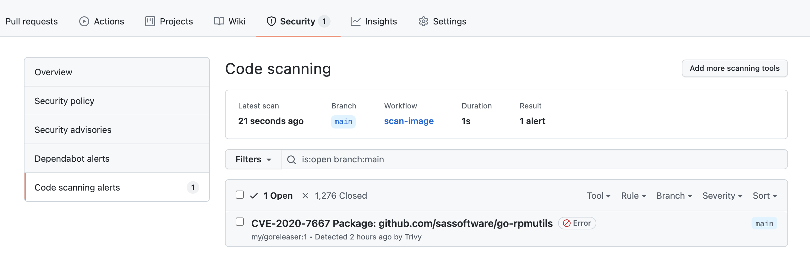

# Detecting Vulnerabilities

## Table of Contents
- [Prerequisites](#prerequisites)
- [Vulnerability Database](#vulnerability-database)
- [Scanning Container Images](#container-images)
  - Tar images
  - Ignore unfixed vulnerabilities
- [Scanning Filesystems](#scanning-filesystems)
  - Rootfs
- [Scanning Git Repositories](#scanning-git-repositories)
- [Binaries created by Golang](#binaries-created-by-golang)
- [CI Integration](#ci-integration)

## Prerequisites

Before you begin, you need the following software:

- A Linux, stand-alone virtual machine (VM)
- [Trivy](https://www.aquasec.com/products/trivy/) command-line tool. [Installation steps here](https://aquasecurity.github.io/trivy/v0.20.0/getting-started/installation/)

### Vulnerability Database

[](https://arxiv.org/pdf/2101.03844.pdf)

> Trivy is stateless and requires no maintenance or preparation.

## Container Images

### **Risk knowledge**

`trivy image --severity HIGH,CRITICAL tomcat:8.0.15-jre7`
<details>
<summary>Show results</summary>

```
2021-10-29T16:25:26.249-0300    ESC[34mINFOESC[0m       Detected OS: debian
2021-10-29T16:25:26.249-0300    ESC[34mINFOESC[0m       Detecting Debian vulnerabilities...
2021-10-29T16:25:26.270-0300    ESC[34mINFOESC[0m       Number of language-specific files: 1
2021-10-29T16:25:26.270-0300    ESC[34mINFOESC[0m       Detecting jar vulnerabilities...
2021-10-29T16:25:26.270-0300    ESC[33mWARNESC[0m       This OS version is no longer supported by the distribution: debian 8.0
2021-10-29T16:25:26.270-0300    ESC[33mWARNESC[0m       The vulnerability detection may be insufficient because security updates are not provided

tomcat:8.0.15-jre7 (debian 8.0)
===============================
Total: 751 (HIGH: 553, CRITICAL: 198)

+--------------------------+------------------+----------+---------------------------+----------------------------------+--------------------------------------------------------------+
|         LIBRARY          | VULNERABILITY ID | SEVERITY |     INSTALLED VERSION     |          FIXED VERSION           |                            TITLE                             |
+--------------------------+------------------+----------+---------------------------+----------------------------------+--------------------------------------------------------------+
| apt                      | CVE-2019-3462    | HIGH     | 1.0.9.5                   | 1.0.9.8.5                        | Incorrect sanitation of                                      |
|                          |                  |          |                           |                                  | the 302 redirect field in                                    |
|                          |                  |          |                           |                                  | HTTP transport method of...                                  |
|                          |                  |          |                           |                                  | -->avd.aquasec.com/nvd/cve-2019-3462                         |
+--------------------------+------------------+          +---------------------------+----------------------------------+--------------------------------------------------------------+
| bash                     | CVE-2016-7543    |          | 4.3-11                    | 4.3-11+deb8u1                    | bash: Specially crafted                                      |
|                          |                  |          |                           |                                  | SHELLOPTS+PS4 variables                                      |
|                          |                  |          |                           |                                  | allows command substitution                                  |
|                          |                  |          |                           |                                  | -->avd.aquasec.com/nvd/cve-2016-7543                         |
+                          +------------------+          +                           +----------------------------------+--------------------------------------------------------------+
|                          | CVE-2019-9924    |          |                           | 4.3-11+deb8u2                    | bash: BASH_CMD is writable                                   |
|                          |                  |          |                           |                                  | in restricted bash shells                                    |
|                          |                  |          |                           |                                  | -->avd.aquasec.com/nvd/cve-2019-9924                         |
+--------------------------+------------------+          +---------------------------+----------------------------------+--------------------------------------------------------------+
| bsdutils                 | CVE-2016-2779    |          | 2.25.2-4                  |                                  | util-linux: runuser tty                                      |
|                          |                  |          |                           |                                  | hijack via TIOCSTI ioctl                                     |
|                          |                  |          |                           |                                  | -->avd.aquasec.com/nvd/cve-2016-2779                         |
+--------------------------+------------------+----------+---------------------------+----------------------------------+--------------------------------------------------------------+
....
```
</details></br>

`trivy image --severity HIGH,CRITICAL --vuln-type os postgres:10.6`

<details>
<summary>Show results</summary>

```
2021-10-29T18:21:09.389-0300    ESC[34mINFOESC[0m       Detected OS: debian
2021-10-29T18:21:09.389-0300    ESC[34mINFOESC[0m       Detecting Debian vulnerabilities...

postgres:10.6 (debian 9.7)
==========================
Total: 331 (HIGH: 228, CRITICAL: 103)

+----------------------+------------------+----------+----------------------------+-----------------------------------+-----------------------------------------+
|       LIBRARY        | VULNERABILITY ID | SEVERITY |     INSTALLED VERSION      |           FIXED VERSION           |                  TITLE                  |
+----------------------+------------------+----------+----------------------------+-----------------------------------+-----------------------------------------+
| bsdutils             | CVE-2016-2779    | HIGH     | 2.29.2-1+deb9u1            |                                   | util-linux: runuser tty                 |
|                      |                  |          |                            |                                   | hijack via TIOCSTI ioctl                |
|                      |                  |          |                            |                                   | -->avd.aquasec.com/nvd/cve-2016-2779    |
+----------------------+------------------+----------+----------------------------+-----------------------------------+-----------------------------------------+
| bzip2                | CVE-2019-12900   | CRITICAL | 1.0.6-8.1                  |                                   | bzip2: out-of-bounds write              |
|                      |                  |          |                            |                                   | in function BZ2_decompress              |
|                      |                  |          |                            |                                   | -->avd.aquasec.com/nvd/cve-2019-12900   |
+----------------------+------------------+----------+----------------------------+-----------------------------------+-----------------------------------------+
| dirmngr              | CVE-2018-1000858 | HIGH     | 2.1.18-8~deb9u3            |                                   | gnupg2: Cross site request              |
|                      |                  |          |                            |                                   | forgery in dirmngr resulting            |
|                      |                  |          |                            |                                   | in an information disclosure...         |
|                      |                  |          |                            |                                   | -->avd.aquasec.com/nvd/cve-2018-1000858 |
+----------------------+------------------+----------+----------------------------+-----------------------------------+-----------------------------------------+
| exim4                | CVE-2019-10149   | CRITICAL | 4.89-2+deb9u3              | 4.89-2+deb9u4                     | exim: Remote command                    |
|                      |                  |          |                            |                                   | execution in deliver_message()          |
|                      |                  |          |                            |                                   | function in /src/deliver.c              |
|                      |                  |          |                            |                                   | -->avd.aquasec.com/nvd/cve-2019-10149   |
+                      +------------------+          +                            +-----------------------------------+-----------------------------------------+
|                      | CVE-2019-13917   |          |                            | 4.89-2+deb9u5                     | exim: ${sort} in configuration          |
|                      |                  |          |                            |                                   | leads to privilege escalation           |
|                      |                  |          |                            |                                   | -->avd.aquasec.com/n:
```
</details></br>

`trivy image --severity HIGH,CRITICAL --vuln-type library node:10.6`

<details>
<summary>Show results</summary>

```
2021-10-29T18:28:53.941-0300    ESC[34mINFOESC[0m       Number of language-specific files: 1
2021-10-29T18:28:53.941-0300    ESC[34mINFOESC[0m       Detecting node-pkg vulnerabilities...

Node.js (node-pkg)
==================
Total: 28 (HIGH: 25, CRITICAL: 3)

+-------------------+------------------+----------+-------------------+-----------------------------+-----------------------------------------+
|      LIBRARY      | VULNERABILITY ID | SEVERITY | INSTALLED VERSION |        FIXED VERSION        |                  TITLE                  |
+-------------------+------------------+----------+-------------------+-----------------------------+-----------------------------------------+
| ansi-regex        | CVE-2021-3807    | HIGH     | 3.0.0             | 5.0.1, 6.0.1                | nodejs-ansi-regex: Regular              |
|                   |                  |          |                   |                             | expression denial of service            |
|                   |                  |          |                   |                             | (ReDoS) matching ANSI escape codes      |
|                   |                  |          |                   |                             | -->avd.aquasec.com/nvd/cve-2021-3807    |
+-------------------+------------------+----------+-------------------+-----------------------------+-----------------------------------------+
| cryptiles         | CVE-2018-1000620 | CRITICAL | 3.1.2             | 4.1.2                       | nodejs-cryptiles: Insecure randomness   |
|                   |                  |          |                   |                             | causes the randomDigits() function      |
|                   |                  |          |                   |                             | returns a pseudo-random data string...  |
|                   |                  |          |                   |                             | -->avd.aquasec.com/nvd/cve-2018-1000620 |
+-------------------+------------------+----------+-------------------+-----------------------------+-----------------------------------------+
| dot-prop          | CVE-2020-8116    | HIGH     | 4.2.0             | 5.1.1, 4.2.1                | nodejs-dot-prop: prototype pollution    |
|                   |                  |          |                   |                             | -->avd.aquasec.com/nvd/cve-2020-8116    |
+-------------------+------------------+----------+-------------------+-----------------------------+-----------------------------------------+
| extend            | CVE-2018-16492   | CRITICAL | 3.0.1             | 2.0.2, 3.0.2                | nodejs-extend: Prototype                |
|                   |                  |          |                   |                             | pollution can allow attackers           |
|                   |                  |          |                   |                             | to modify object properties             |
|                   |                  |          |                   |                             | -->avd.aquasec.com/nvd/cve-2018-16492   |
+-------------------+------------------+----------+-------------------+-----------------------------+-----------------------------------------+
| fstream           | CVE-2019-13173   | HIGH     | 1.0.11            | 1.0.12                      | nodejs-fstream: File overwrite          |
|                   |                  |          |                   |                             | in fstream.DirWriter() function         |
|                   |                  |          |                   |                             | -->avd.aquasec.com/nvd/cve-2019-13173 :
```
</details></br>

Other images samples:
```
trivy image --severity HIGH,CRITICAL jboss/wildfly:10.0.0.Final

trivy image --severity HIGH,CRITICAL tensorflow/tensorflow
```
> [Vulnerable Container List by JGamblin of Kenna Security](https://vulnerablecontainers.org/)

### Tar Images
- Image in tar format (Moby, Buildah, Podman, img, Kaniko) .

`trivy image --input ruby-2.3.0.tar`

- Image build following the OCI Image Specification: Buildah, Skopeo. [Trivy OCI Image support](https://aquasecurity.github.io/trivy/dev/advanced/container/oci/)

### **Unfixed vulnerabilities**

Traditional scanners ignore unfixed by default.

`trivy image ubuntu:20.04`

<details>
<summary>Show results</summary>

```
trivy image ubuntu:20.04 | more
2021-10-29T19:08:47.197-0300    ESC[34mINFOESC[0m       Detected OS: ubuntu
2021-10-29T19:08:47.197-0300    ESC[34mINFOESC[0m       Detecting Ubuntu vulnerabilities...
2021-10-29T19:08:47.201-0300    ESC[34mINFOESC[0m       Number of language-specific files: 0

ubuntu:20.04 (ubuntu 20.04)
===========================
Total: 22 (UNKNOWN: 0, LOW: 22, MEDIUM: 0, HIGH: 0, CRITICAL: 0)

+------------+------------------+----------+--------------------------+---------------+-----------------------------------------+
|  LIBRARY   | VULNERABILITY ID | SEVERITY |    INSTALLED VERSION     | FIXED VERSION |                  TITLE                  |
+------------+------------------+----------+--------------------------+---------------+-----------------------------------------+
| bash       | CVE-2019-18276   | LOW      | 5.0-6ubuntu1.1           |               | bash: when effective UID is not         |
|            |                  |          |                          |               | equal to its real UID the...            |
|            |                  |          |                          |               | -->avd.aquasec.com/nvd/cve-2019-18276   |
+------------+------------------+          +--------------------------+---------------+-----------------------------------------+
| coreutils  | CVE-2016-2781    |          | 8.30-3ubuntu2            |               | coreutils: Non-privileged               |
|            |                  |          |                          |               | session can escape to the               |
|            |                  |          |                          |               | parent session in chroot                |
|            |                  |          |                          |               | -->avd.aquasec.com/nvd/cve-2016-2781    |
+------------+------------------+          +--------------------------+---------------+-----------------------------------------+
| libc-bin   | CVE-2016-10228   |          | 2.31-0ubuntu9.2          |               | glibc: iconv program can hang           |
|            |                  |          |                          |               | when invoked with the -c option         |
|            |                  |          |                          |               | -->avd.aquasec.com/nvd/cve-2016-10228   |
+            +------------------+          +                          +---------------+-----------------------------------------+
|            | CVE-2019-25013   |          |                          |               | glibc: buffer over-read in              |
|            |                  |          |                          |               | iconv when processing invalid           |
|            |                  |          |                          |               | multi-byte input sequences in...        |
|            |                  |          |                          |               | -->avd.aquasec.com/nvd/cve-2019-25013   |
+            +------------------+          +                          +---------------+-----------------------------------------+
|            | CVE-2020-27618   |          |                          |               | glibc: iconv when processing            |
|            |                  |          |                          |               | invalid multi-byte input                |
|            |                  |          |                          |               | sequences fails to advance the...       |
|            |                  |          |                          |               | -->avd.aquasec.com/nvd/cve-2020-27618   |
+            +------------------+          +                          +---------------+-----------------------------------------+
|            | CVE-2020-29562   |          |                          |               | glibc: assertion failure in iconv       |
|            |                  |          |                          |               | when converting invalid UCS4            |
|            |                  |          |                          |               | -->avd.aquasec.com/nvd/cve-2020-29562   |
+            +------------------+          +                          +---------------+-----------------------------------------+
|            | CVE-2020-6096    |          |                          |               | glibc: signed comparison                |
|            |                  |          |                          |               | vulnerability in the                    |
|            |                  |          |                          |               | ARMv7 memcpy function                   |
|            |                  |          |                          |               | -->avd.aquasec.com/nvd/cve-2020-6096    |
+            +------------------+          +                          +---------------+-----------------------------------------+
|            | CVE-2021-27645   |          |                          |               | glibc: Use-after-free in                |
|            |                  |          |                          |               | addgetnetgrentX function                |
|            |                  |          |                          |               | in netgroupcache.c                      |
|            |                  |          |                          |               | -->avd.aquasec.com/nvd/cve-2021-27645   |
+            +------------------+          +                          +---------------+-----------------------------------------+
|            | CVE-2021-3326    |          |                          |               | glibc: Assertion failure in             |
|            |                  |          |                          |               | ISO-2022-JP-3 gconv module              |
```
</details></br>

`trivy image --ignore-unfixed ubuntu:20.04`

<details>
<summary>Show results</summary>

```
 trivy image --ignore-unfixed ubuntu:20.04
2021-10-29T19:14:43.504-0300	INFO	Detected OS: ubuntu
2021-10-29T19:14:43.504-0300	INFO	Detecting Ubuntu vulnerabilities...
2021-10-29T19:14:43.511-0300	INFO	Number of language-specific files: 0

ubuntu:20.04 (ubuntu 20.04)
===========================
Total: 0 (UNKNOWN: 0, LOW: 0, MEDIUM: 0, HIGH: 0, CRITICAL: 0)
```
</details></br>

> Some Linux distributions (e.g. Debian or Ubuntu) will release information about CVEs for which there is no released patched package, and so you get the question of “should a vulnerability scanner report those?”.
>  [Unfixed vulnerabilities in traditional scanners](https://raesene.github.io/blog/2020/11/22/When_Is_A_Vulnerability_Not_A_Vulnerability/)


## Scanning Filesystems

```
git clone https://github.com/goreleaser/goreleaser.git
cd goreleaser && trivy fs .
```

<details>
<summary>Show results</summary>

```
cd goreleaser && trivy fs .
2021-11-01T08:49:28.257-0300	INFO	Number of language-specific files: 1
2021-11-01T08:49:28.257-0300	INFO	Detecting gomod vulnerabilities...

go.sum (gomod)
==============
Total: 3 (UNKNOWN: 0, LOW: 0, MEDIUM: 1, HIGH: 2, CRITICAL: 0)

+------------------------------------+------------------+----------+-----------------------------------+---------------------------------------+-----------------------------------------+
|              LIBRARY               | VULNERABILITY ID | SEVERITY |         INSTALLED VERSION         |             FIXED VERSION             |                  TITLE                  |
+------------------------------------+------------------+----------+-----------------------------------+---------------------------------------+-----------------------------------------+
| github.com/dgrijalva/jwt-go        | CVE-2020-26160   | HIGH     | 3.2.0+incompatible                |                                       | jwt-go: access restriction              |
|                                    |                  |          |                                   |                                       | bypass vulnerability                    |
|                                    |                  |          |                                   |                                       | -->avd.aquasec.com/nvd/cve-2020-26160   |
+------------------------------------+------------------+----------+-----------------------------------+---------------------------------------+-----------------------------------------+
| github.com/miekg/dns               | CVE-2019-19794   | MEDIUM   | 1.0.14                            | v1.1.25-0.20191211073109-8ebf2e419df7 | golang-github-miekg-dns: predictable    |
|                                    |                  |          |                                   |                                       | TXID can lead to response forgeries     |
|                                    |                  |          |                                   |                                       | -->avd.aquasec.com/nvd/cve-2019-19794   |
+------------------------------------+------------------+----------+-----------------------------------+---------------------------------------+-----------------------------------------+
| github.com/sassoftware/go-rpmutils | CVE-2020-7667    | HIGH     | 0.0.0-20190420191620-a8f1baeba37b | v0.1.0                                | In package                              |
|                                    |                  |          |                                   |                                       | github.com/sassoftware/go-rpmutils/cpio |
|                                    |                  |          |                                   |                                       | before version 0.1.0, the               |
|                                    |                  |          |                                   |                                       | CPIO extraction functionality           |
|                                    |                  |          |                                   |                                       | doesn't sanitize...                     |
|                                    |                  |          |                                   |                                       | -->avd.aquasec.com/nvd/cve-2020-7667    |
+------------------------------------+------------------+----------+-----------------------------------+---------------------------------------+-----------------------------------------+
```
</details></br>

### Rootfs

Scan a root filesystem (such as a host machine, a virtual machine image, or an unpacked container image filesystem).

Scanning a sample Ubuntu VM rootfs:
`sudo trivy rootfs --severity HIGH,CRITICAL --ignore-unfixed  /`


<details>
<summary>Show results</summary>


</details></br>

Scanning container image filesystem. Here a sample creating a sample rootfs from Alpine:
```
docker export $(docker create alpine:3.11) | tar -C /tmp/my-rootfs -xvf -

trivy rootfs /tmp/my-rootfs
```

<details>
<summary>Show results</summary>


</details></br>

## Scanning Git repositories

`trivy repo https://github.com/goreleaser/goreleaser.git`

<details>
<summary>Show results</summary>

```
2021-11-01T08:46:01.631-0300	INFO	Need to update DB
2021-11-01T08:46:01.631-0300	INFO	Downloading DB...
24.51 MiB / 24.51 MiB [---------------------------------------------------------------------------------------------------------------------------------------------------------------------------------------------] 100.00% 31.01 MiB p/s 1s
Enumerating objects: 10085, done.
Counting objects: 100% (10085/10085), done.
Compressing objects: 100% (5391/5391), done.
Total 10085 (delta 6407), reused 7665 (delta 4391), pack-reused 0
2021-11-01T08:46:20.794-0300	INFO	Number of language-specific files: 1
2021-11-01T08:46:20.794-0300	INFO	Detecting gomod vulnerabilities...

go.sum (gomod)
==============
Total: 3 (UNKNOWN: 0, LOW: 0, MEDIUM: 1, HIGH: 2, CRITICAL: 0)

+------------------------------------+------------------+----------+-----------------------------------+---------------------------------------+-----------------------------------------+
|              LIBRARY               | VULNERABILITY ID | SEVERITY |         INSTALLED VERSION         |             FIXED VERSION             |                  TITLE                  |
+------------------------------------+------------------+----------+-----------------------------------+---------------------------------------+-----------------------------------------+
| github.com/dgrijalva/jwt-go        | CVE-2020-26160   | HIGH     | 3.2.0+incompatible                |                                       | jwt-go: access restriction              |
|                                    |                  |          |                                   |                                       | bypass vulnerability                    |
|                                    |                  |          |                                   |                                       | -->avd.aquasec.com/nvd/cve-2020-26160   |
+------------------------------------+------------------+----------+-----------------------------------+---------------------------------------+-----------------------------------------+
| github.com/miekg/dns               | CVE-2019-19794   | MEDIUM   | 1.0.14                            | v1.1.25-0.20191211073109-8ebf2e419df7 | golang-github-miekg-dns: predictable    |
|                                    |                  |          |                                   |                                       | TXID can lead to response forgeries     |
|                                    |                  |          |                                   |                                       | -->avd.aquasec.com/nvd/cve-2019-19794   |
+------------------------------------+------------------+----------+-----------------------------------+---------------------------------------+-----------------------------------------+
| github.com/sassoftware/go-rpmutils | CVE-2020-7667    | HIGH     | 0.0.0-20190420191620-a8f1baeba37b | v0.1.0                                | In package                              |
|                                    |                  |          |                                   |                                       | github.com/sassoftware/go-rpmutils/cpio |
|                                    |                  |          |                                   |                                       | before version 0.1.0, the               |
|                                    |                  |          |                                   |                                       | CPIO extraction functionality           |
|                                    |                  |          |                                   |                                       | doesn't sanitize...                     |
|                                    |                  |          |                                   |                                       | -->avd.aquasec.com/nvd/cve-2020-7667    |
+------------------------------------+------------------+----------+-----------------------------------+---------------------------------------+-----------------------------------------+
```
</details></br>

## Binaries created by golang

Download a sample binary golang
```
mkdir mytest && cd mytest
curl -LO "https://github.com/goreleaser/goreleaser/releases/download/v0.183.0/goreleaser_Linux_arm64.tar.gz"
tar -xvf goreleaser_Linux_arm64.tar.gz
```

Scanning the folder
`trivy rootfs .`

<details>
<summary>Show results</summary>

```
 trivy rootfs .
2021-11-01T08:59:45.409-0300	INFO	Number of language-specific files: 1
2021-11-01T08:59:45.409-0300	INFO	Detecting gobinary vulnerabilities...

goreleaser (gobinary)
=====================
Total: 1 (UNKNOWN: 0, LOW: 0, MEDIUM: 0, HIGH: 1, CRITICAL: 0)

+------------------------------------+------------------+----------+------------------------------------+---------------+-----------------------------------------+
|              LIBRARY               | VULNERABILITY ID | SEVERITY |         INSTALLED VERSION          | FIXED VERSION |                  TITLE                  |
+------------------------------------+------------------+----------+------------------------------------+---------------+-----------------------------------------+
| github.com/sassoftware/go-rpmutils | CVE-2020-7667    | HIGH     | v0.0.0-20190420191620-a8f1baeba37b | v0.1.0        | In package                              |
|                                    |                  |          |                                    |               | github.com/sassoftware/go-rpmutils/cpio |
|                                    |                  |          |                                    |               | before version 0.1.0, the               |
|                                    |                  |          |                                    |               | CPIO extraction functionality           |
|                                    |                  |          |                                    |               | doesn't sanitize...                     |
|                                    |                  |          |                                    |               | -->avd.aquasec.com/nvd/cve-2020-7667    |
+------------------------------------+------------------+----------+------------------------------------+---------------+-----------------------------------------+
```
</details></br>

> See more details about [Language-specific Packages](https://aquasecurity.github.io/trivy/dev/vulnerability/detection/language/)

## CI Integration

Using [trivy-action](https://github.com/aquasecurity/trivy-action) you can implement the scanning with the github action for Trivy.

Sample github workflow used [here](https://github.com/krol3/demo-trivy/blob/main/.github/workflows/scan-image.yaml)


Using Sarif.tpl report with Github

